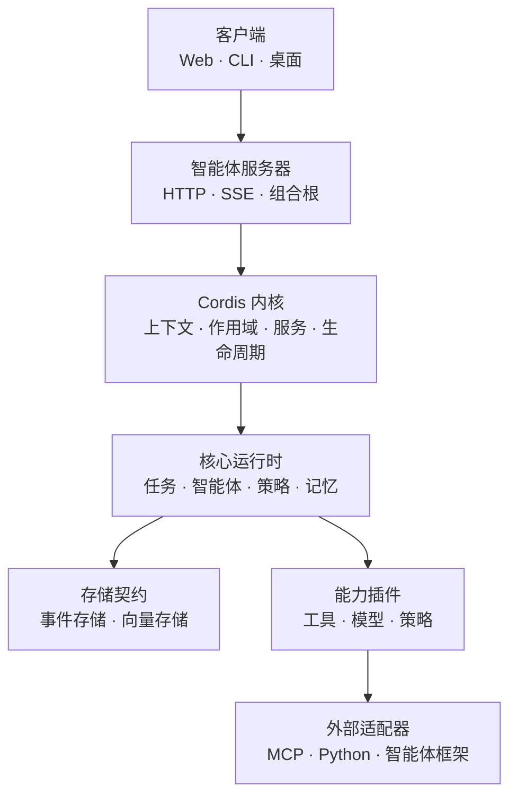

<p align="center">
  
</p>

<h1 align="center">Bee Agent</h1>

<p align="center">
  <strong>基于 Cordis 的插件组合、模块化、可跟踪、可扩展、自进化的智能体</strong>
</p>

<p align="center">
  <a href="https://github.com/darifo/bee-agent/actions/workflows/ci.yml">
    
  </a>
  <a href="LICENSE">
    
  </a>
  <a href="https://nodejs.org/">
    
  </a>
  <a href="https://www.typescriptlang.org/">
    
  </a>
  
</p>

<p align="center">
  <a href="./README.md">English</a> | 简体中文
</p>

---

## 项目总览

Bee Agent 是一个开源的、基于 Cordis 的插件组合智能体。它将智能体运行时、
工具、策略、存储适配器和外部 worker 以插件方式组装在一起，而不把它们耦合进
单一的单体核心。项目围绕显式的生命周期管理、只追加（append-only）的执行
历史、稳定的插件契约和可替换的基础设施来设计。

项目旨在通过一个可检查、可测试、可暂停、可恢复、可扩展的共享运行时，支持
编程、研究、办公自动化、数据分析与内容创作等工作流。

## 为什么选择 Bee Agent？

- **模块化设计** — 运行时能力位于包与插件边界之后，而不是堆积在单一核心中。
- **可跟踪执行** — 任务事件只追加、有序、可重放。
- **生命周期安全** — Cordis 上下文与作用域管理服务、副作用（effect）和任务级
  资源清理。
- **存储可移植** — 领域契约将 SQLite 与 PostgreSQL 的细节隔离在运行时代码
  之外。
- **Schema 优先契约** — Zod schema 在各包之间同时提供运行时校验和严格的
  TypeScript 类型。
- **可扩展能力** — 架构为工具、策略、模型、MCP 集成、Python worker 和外部
  智能体预留了干净的边界。
- **自进化组合** — 智能体通过在稳定契约之后挂载、替换和升级插件来演化，
  而不是重写核心。

## 架构



上图中 Web 客户端属于规划中的层次。服务器、客户端 SDK 与 CLI 目前已经实现，
与内核、核心运行时、契约、存储抽象和 SQLite 事件存储一起构成可用的基座。

## 当前能力

| 领域              | 状态   | 说明                                                                                                                                |
| ----------------- | ------ | ----------------------------------------------------------------------------------------------------------------------------------- |
| Monorepo 工具链   | 已可用 | pnpm workspaces、严格 TypeScript、ESLint、Prettier、Vitest、Changesets、CI                                                          |
| 共享契约          | 已可用 | 任务、事件、工具、审批、记忆、嵌入、向量检索、API 与 SSE schema                                                                     |
| Cordis 内核       | 已可用 | 生命周期状态机、服务键目录与等待、带 waterfall 中间件的领域事件、支持服务隔离的任务作用域、Cordis 与 Bee Agent 插件挂载             |
| 核心运行时        | 已可用 | 带可重放生命周期事件与快照的任务状态机、智能体契约与模拟智能体、工具注册表与 `tools/execute` 管线、含审批挂起、过期与取消的策略引擎 |
| SQLite 存储       | 已可用 | 迁移、事务、回滚、只追加事件、原子任务序列、重放                                                                                    |
| 服务器            | 已可用 | Fastify 组合根：含任务列表的 REST 命令、支持 `Last-Event-ID` 续传的 SSE 事件流、审批决定、CORS（含劫持流）、状态码映射的错误信封    |
| 客户端 SDK 与 CLI | 已可用 | `@bee-agent/client`（REST + 支持中止的 SSE 流，浏览器安全的 fetch）与 `bee` CLI（任务 list/create/run/watch/cancel 与审批 decide）  |
| Web 界面          | 已可用 | 基于 Client SDK 的 React 19 + Vite 控制台：任务创建、实时 SSE 事件流、带理由的审批通过与拒绝、取消，jsdom 组件测试                  |
| PostgreSQL 存储   | 规划中 | 插件边界与 ADR 已定义，实现延后                                                                                                     |
| pgvector 记忆     | 规划中 | Vector Store 契约与插件边界已定义，检索延后                                                                                         |

## 环境要求

- [Node.js](https://nodejs.org/zh-cn) 22 或更高版本
- [pnpm](https://pnpm.io/zh-cn) 10

## 快速开始

克隆仓库并安装依赖：

```bash
git clone git@github.com:darifo/bee-agent.git
cd bee-agent
pnpm install
```

运行完整的本地验证套件：

```bash
pnpm build
pnpm typecheck
pnpm lint
pnpm test
```

启动服务器并用 CLI 或 Web 控制台驱动：

```bash
pnpm --filter @bee-agent/server start          # http://127.0.0.1:3000

export BEE_AGENT_URL=http://127.0.0.1:3000
bee() { pnpm --filter @bee-agent/cli bee -- "$@"; }
bee task create -i "hello"                     # 输出任务 id
bee task run <taskId>                          # 流式输出事件直到任务结束

pnpm --filter @bee-agent/web dev               # http://localhost:5173
```

## 仓库结构

```text
bee-agent/
├── apps/
│   ├── server/              # Fastify HTTP + SSE 组合根
│   ├── cli/                 # 基于 Commander 的 `bee` 客户端
│   └── web/                 # React 19 + Vite 任务控制台
├── packages/
│   ├── contracts/           # Zod schema 与共享领域/传输类型
│   ├── plugin-sdk/          # 公开的插件清单与生命周期契约
│   ├── kernel/              # Cordis 基座：生命周期、服务、作用域、插件
│   ├── runtime/             # 核心运行时：任务循环、状态机、智能体、策略、工具
│   ├── client/              # 客户端 SDK：REST 命令 + SSE 事件流
│   ├── storage/             # 存储与事务边界
│   ├── event-store/         # 只追加事件存储契约
│   └── vector-store/        # 向量存储与嵌入空间边界
├── plugins/
│   ├── storage/sqlite/      # 可用的 SQLite 存储与事件存储
│   ├── storage/postgres/    # 预留的 PostgreSQL 适配器边界
│   ├── tools/calculator/    # 可用的计算器工具插件
│   └── vector/pgvector/     # 预留的 pgvector 适配器边界
├── adapters/                # 未来的外部协议与智能体适配器
├── python/                  # 未来的 Python worker 项目
├── migrations/              # 方言相关的数据库迁移
├── configs/                 # 环境配置示例
├── tests/                   # 共享契约、集成与端到端测试套件
└── docs/adr/                # 架构决策记录（ADR）
```

## 开发

| 命令                | 用途                              |
| ------------------- | --------------------------------- |
| `pnpm build`        | 构建所有已实现的 workspace 包     |
| `pnpm typecheck`    | 在整个 workspace 运行严格 TS 检查 |
| `pnpm lint`         | 运行 ESLint                       |
| `pnpm test`         | 运行所有包的测试                  |
| `pnpm format`       | 使用 Prettier 格式化支持的文件    |
| `pnpm format:check` | 只校验格式，不修改文件            |
| `pnpm changeset`    | 描述一次包级别的发布变更          |

### 工作区规则

- 只通过包导出（package exports）引用其他 workspace，绝不引用其内部 `src/`
  路径。
- 核心包保持独立，不依赖具体插件。
- 数据库特定行为保持在存储适配器内部。
- 每个包和插件都有自己的 manifest 与公开边界。
- 为公开契约和生命周期敏感行为添加测试。

## 数据库模型

SQLite 是本阶段唯一可用的数据库适配器。其事件存储通过事务和每任务序列行
来分配单调递增的事件序列，不使用不安全的 `MAX(sequence) + 1` 分配方式。

SQLite 与 PostgreSQL 是两种独立的运行模式：Bee Agent 绝不会同时双写两个
数据库。向量数据也通过独立的 Vector Store 契约与任务事件表分离。

## 路线图

- [x] 初始化 pnpm TypeScript monorepo 与质量工具链
- [x] 定义共享契约与插件 SDK 边界
- [x] 实现 Cordis 内核与任务作用域清理
- [x] 实现并测试 SQLite 事件存储
- [x] 增加任务状态机、策略引擎、计算器工具与模拟智能体
- [x] 增加 HTTP/SSE 服务器、客户端 SDK 与 CLI
- [x] 增加 React Web 界面
- [ ] 基于共享存储契约套件实现 PostgreSQL
- [ ] 实现 pgvector 与嵌入空间校验
- [ ] 增加记忆、真实模型提供商、MCP、Python worker 与外部智能体

架构决策及其约束记录在 [`docs/adr`](./docs/adr) 中。

## 参与贡献

在架构成型阶段，欢迎参与贡献。

1. 先提 issue 讨论重大的行为或公开 API 变更。
2. Fork 仓库并创建一个聚焦的分支。
3. 为你的变更新增或更新测试。
4. 运行 `pnpm build`、`pnpm typecheck`、`pnpm lint` 与 `pnpm test`。
5. 提交 pull request，说明动机、行为与取舍。

请将变更控制在包边界之内，并将重大架构决策记录为 ADR。

## 许可证

Bee Agent 基于 [MIT License](./LICENSE) 发布。
