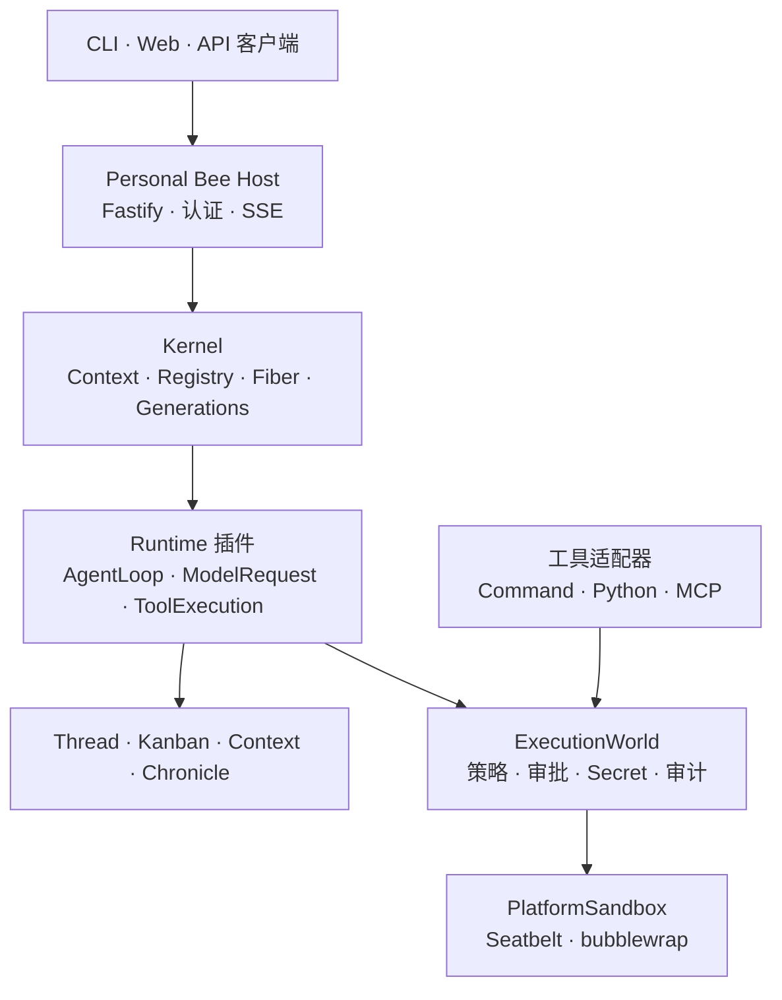

<p align="center">
  
</p>

<h1 align="center">Bee Agent</h1>

<p align="center">
  <strong>插件组合、全程可追溯、强制沙箱化的个人智能体运行时</strong>
</p>

<p align="center">
  <a href="./README.md">English</a> | 简体中文
</p>

## 项目状态

Bee Agent v1 正在 `main` 分支开发。它与冻结在
`v0.11.0-legacy` 的旧版本 clean break，不保留旧 TaskRuntime、插件 SDK、
进程工具、存储模式或外部智能体 API 的兼容层。

当前已实现的本地优先 Personal Bee Host 包括：

- Cordis 派生的 Context–Registry–Fiber 插件运行时；
- 版本化 StructureGeneration、A/B/C 调和与 Turn 级 generation lease；
- 精确版本、受信任的 PluginCatalog 组合与配置源自动刷新；
- Chronicle 支撑的 Thread–Turn–Item 协议；
- 持久 Kanban 任务平面；
- 预算化上下文和 Tool/Skill 延迟解析；
- 持久模型请求与可恢复 AgentLoop checkpoint；
- 流式模型交互（SSE + Retry-After 退避）、thread 级会话连续性、memoize 系统提示词，
  以及两级上下文压缩（工具结果省略 + 持久化摘要）——只折叠模型可见视图、永不改写日志；
- fail-closed 的工具并发分类调度（并行安全工具有界并行、结果按模型序提交）；
- keyless 录制会话回放 harness，把精确的模型可见请求与 Chronicle 流钉进回归基线；
- deny-by-default 的 ExecutionWorld、审批、secret、sandbox、审计和幂等边界；
- 沙箱化 Command、Python 与 manifest-pinned MCP adapters；
- 个人记忆：Claim/Observation 契约、内嵌召回与近线派生、`/memory` 治理路由，
  远程记忆经断路器 + 持久健康事件显式降级；
- 版本化世界模型：事实仅经带来源 projector 进入，digest 可校验重建，
  `GET /world` 只读视图与 `GET /structure` lineage；
- 轨迹回放：Turn 因果链投影与模型可见上下文的 digest 精确重放；
- 长时运行：持久化调度器（时间/Kanban 条件/事件触发）绑定线程跨天续跑，
  停机错过按原节律 fire-once 追赶；
- 统一个人数据目录：持久产物默认落在 `BEE_AGENT_DATA_DIR` 或平台约定位置。

现行设计和开发状态见 [`docs/architecture`](./docs/architecture)，架构决策见
[`docs/adr`](./docs/adr)，HTTP API 参考见 [`docs/api.md`](./docs/api.md)。

## 架构



Kernel 管理活插件图，Chronicle 保存持久事实。每个 Turn 固定一个
StructureGeneration，因此结构变化不会在执行中途替换 Model、Tool、Policy 或
AgentLoop。

外部副作用只有一条执行路径：

```text
tool intent
  → ToolAdapter.describe()
  → canonical ActionRequest
  → deny / ask / allow
  → 持久审批
  → secret 晚绑定
  → 强制 SandboxProvider
  → snapshot / execute / diff / verify
  → 持久结果
  → ToolAdapter.present()
```

只有 `packages/execution` 可以导入 Node 子进程 API，仓库级静态边界检查会强制
这一规则。

## 当前能力

| 领域       | 状态   | 当前实现                                                                                                                                                                                                                                                      |
| ---------- | ------ | ------------------------------------------------------------------------------------------------------------------------------------------------------------------------------------------------------------------------------------------------------------- |
| Kernel     | 已可用 | Proxy Context、作用域服务、`inject`、Registry/Fiber、owned effects、A/B/C 调和与回滚、lease、quarantine 和 Doctor                                                                                                                                             |
| Structure  | 已可用 | EffectiveStructure 摘要复算、受信任精确版本 PluginCatalog、factory registry、配置源刷新、串行 reconcile、生命周期事实与重启重建                                                                                                                               |
| 对话       | 已可用 | Chronicle-backed Thread–Turn–Item、SSE 重放/续传、审批挂起/恢复、取消和 checkpoint 恢复；thread 级会话连续性（先前 turn 的对话随新 turn 一并携带）                                                                                                            |
| 任务       | 已可用 | 持久 Kanban 状态机、依赖、claim/lease/heartbeat、dispatcher 恢复，以及 REST/SDK/CLI/Web 视图                                                                                                                                                                  |
| 上下文     | 已可用 | ContextManifest、预算分配、受保护区段、omission 记录、Tool/Skill 索引与延迟解析、token baseline 门禁；模型可见视图两级压缩——预算内工具结果省略（错误结果与近期窗口受保护）+ LLM 摘要压缩（digest 校验的 `context.compacted` 事件、每 turn 尝试熔断）          |
| 模型       | 已可用 | OpenAI-compatible LLMRuntime 真 SSE 流式（增量即推、流式工具参数组装、JSON 回退、超时仅覆盖响应头）、Retry-After 感知退避、工具参数校验回传模型、`max_tokens` 升档续跑，持久 ModelRequestService 摘要校验恢复                                                 |
| 执行       | 已可用 | ActionRequest、完整权限交集快照、持久审批、幂等/重建、Keychain/Secret Service、artifact 防泄漏、sandbox routing、snapshot/diff；并发分类的工具调度——并行安全工具有界并行、独占工具保序、结果按模型序提交，挂起/崩溃的 step 会补完剩余调用                     |
| 平台沙箱   | 已可用 | macOS Seatbelt 与 Linux bubblewrap、Ubuntu 真机 CI、空子进程环境、进程组取消、输入/超时/输出上限                                                                                                                                                              |
| Command    | 已可用 | 可选 `command_run`；Host 固定 native executable allowlist 与 canonical workspace                                                                                                                                                                              |
| Python     | 已可用 | 可选 `python_run`；固定 native interpreter、bounded JSON stdin、显式 runtime 只读根                                                                                                                                                                           |
| MCP        | 已可用 | 可选 `mcp__<server>__<tool>`；Host-pinned manifests 与分阶段 JSON-lines initialize/call                                                                                                                                                                       |
| 存储       | 已可用 | SQLite Chronicle 与 Kanban adapter；v0 的 PostgreSQL/pgvector 已在 clean break 中删除                                                                                                                                                                         |
| 外部智能体 | 可选   | bounded delegation、parent/child trajectory lineage、exact-origin network sandbox 与声明式 RemoteAgent v2                                                                                                                                                     |
| 记忆       | 进行中 | MemoryProvider 契约与契约套件；内嵌 memory-bee（Chronicle 投影、词法召回、偏好/纠正派生、合并）；retrieve hook 召回与近线派生已接入 Host，`/memory` 治理路由可查看/遗忘/导出；远程记忆断路器/显式降级 + HTTP transport（`BEE_AGENT_MEMORY_REMOTE_URL`）已就绪 |
| 世界模型   | 进行中 | 实体/关系/版本化快照 + `world` Chronicle 流（版本 digest 可校验重建）；事实仅经带来源 projector（工具使用/执行资源）进入；Host 追赶重放 + 实时投影，`GET /world` 只读视图；StructureGraph lineage 经 `GET /structure` 暴露                                    |
| 轨迹回放   | 进行中 | `GET /threads/:id/turns/:turnId/trajectory` 投影 Turn 因果链（generation 的结构版本与模型输入 digest、tool 的授权决策与结果、checkpoint）；`GET /model-requests/:id/replay` 精确重放模型可见上下文；checkpoint fork 待做                                      |
| 长时运行   | 进行中 | 持久化 AgentScheduler：一次性/周期/条件触发器（Kanban 任务状态持久追赶、事件边沿触发）绑定 Thread 跨天跨重启续跑；停机错过的周期 fire-once 合并并按原节律恢复；`/scheduler` 触发器管理与手动 tick；守护形态待做                                               |
| 学习       | 计划中 | 包边界已建立，Phase 5 实现尚未成为 Host 能力                                                                                                                                                                                                                  |

## 环境要求

- Node.js 22 或更高版本
- pnpm 10
- 外部进程工具需要 macOS `/usr/bin/sandbox-exec` 或 Linux bubblewrap；无法
  强制隔离时会 fail closed

## 构建与验证

```bash
pnpm install
pnpm build
pnpm typecheck
pnpm lint
pnpm format:check
pnpm test
```

## 启动 Host

Host 必须配置 OpenAI-compatible 模型。未指定 session token 时会生成并记录
一个 token；CLI/Web 联调建议显式设置。

```bash
export BEE_AGENT_MODEL_API_KEY='<key>'
export BEE_AGENT_MODEL_NAME='<model>'
export BEE_AGENT_MODEL_BASE_URL='https://api.deepseek.com'
export BEE_AGENT_SESSION_TOKEN='local-development-token'
# 可选：整体替换默认的 Bee 系统提示词
# export BEE_AGENT_SYSTEM_PROMPT='你的指令'

pnpm --filter @bee-agent/bee start
```

默认地址为 `http://127.0.0.1:3000`。没有 `BEE_AGENT_SESSION_TOKEN` 时，Host
拒绝绑定非 loopback 地址。Host 与 CLI 均自动加载 `apps/bee/.env`（模板见
`apps/bee/.env.example`）；全部环境变量速查见
[`docs/api.md`](./docs/api.md#环境变量速查)。

使用 CLI：

```bash
export BEE_AGENT_URL='http://127.0.0.1:3000'
pnpm --filter @bee-agent/cli build

pnpm --filter @bee-agent/cli bee -- chat
pnpm --filter @bee-agent/cli bee -- thread create --title '研究'
pnpm --filter @bee-agent/cli bee -- kanban list
```

运行 Web：

```bash
VITE_BEE_AGENT_URL='http://127.0.0.1:3000' \
VITE_BEE_AGENT_SESSION_TOKEN="$BEE_AGENT_SESSION_TOKEN" \
pnpm --filter @bee-agent/web dev
```

## 可选外部工具

以下工具未显式配置时，不会进入 EffectiveStructure 或模型上下文。

### Command

```bash
export BEE_AGENT_COMMAND_EXECUTABLES='/bin/echo,/usr/bin/git'
export BEE_AGENT_COMMAND_WORKSPACE="$PWD"
export BEE_AGENT_COMMAND_MAX_TIMEOUT_MS=30000
export BEE_AGENT_COMMAND_MAX_OUTPUT_BYTES=1048576
```

入口必须是 native executable。执行脚本时，应 allowlist 原生解释器并把脚本
作为 argv 传入。

### Python

```bash
export BEE_AGENT_PYTHON_EXECUTABLE='/绝对路径/native-python3'
export BEE_AGENT_PYTHON_WORKSPACE="$PWD"
export BEE_AGENT_PYTHON_RUNTIME_READ_PATHS='/绝对路径/python/runtime'
export BEE_AGENT_PYTHON_MAX_INPUT_BYTES=1048576
export BEE_AGENT_PYTHON_MAX_TIMEOUT_MS=30000
export BEE_AGENT_PYTHON_MAX_OUTPUT_BYTES=1048576
```

runtime paths 是 Host 控制的逗号分隔只读 allowlist，用于标准库和 native
modules。macOS 不应把 `/usr/bin/python3` developer-tools shim 配为解释器。

### MCP stdio

`BEE_AGENT_MCP_MANIFESTS` 是 JSON 数组。工具 schema、executable、路径、secret
与资源范围都由 Host 固定，启动时不执行隐式、未审批的 discovery。

```bash
export BEE_AGENT_MCP_MANIFESTS='[{"name":"local","protocolVersion":"2024-11-05","executable":"/绝对路径/native-node","arguments":["/workspace/server.mjs"],"workspaceRoot":"/workspace","runtimeReadPaths":["/绝对路径/node/runtime"],"readPaths":["server.mjs"],"writePaths":[],"tools":[{"name":"lookup","description":"查询本地数据","inputSchema":{"type":"object","properties":{"query":{"type":"string"}},"required":["query"],"additionalProperties":false}}]}]'
```

当前 PlatformSandbox 拒绝网络且不支持 network allowlist，因此只能启用无网络
stdio server。

## 仓库结构

```text
apps/
  bee/                    Personal Bee Host 与组合根
  cli/                    基于 @bee-agent/client 的 Thread/Kanban CLI
  web/                    React 对话与 Kanban 控制台
packages/
  kernel/                 Context–Registry–Fiber + StructureGeneration
  knowledge/              Chronicle 契约与持久 schema
  thread/                 Thread–Turn–Item 协议
  kanban/                 持久任务平面
  context/                上下文预算与 Tool/Skill 延迟索引
  execution/              授权、secret、sandbox 与审计管线
  runtime/                AgentLoop、ModelRequest 与 ToolExecution 插件
  model-providers/         OpenAI-compatible LLM provider
  client/                 REST/SSE 客户端 SDK
  storage/                存储原语
adapters/
  storage/sqlite/          Chronicle 与 Kanban SQLite 实现
  tools/command/           command_run 声明
  tools/python/            python_run 声明
  tools/mcp/               manifest-pinned MCP stdio 声明
plugins/
  memory-bee/              默认内嵌记忆提供者（memory 流投影 + 召回/派生）
  memory-remote/           远程记忆接缝：桥接 transport + 断路器提供者，
                          健康迁移持久化为事件
```

## 路线图

- [x] Phase 1：clean-break kernel、Chronicle、Thread–Turn–Item 与 Host
- [x] Phase 2：持久 Kanban、上下文预算与 Tool/Skill 延迟解析
- [x] Phase 3：ExecutionWorld、权限快照/审批、系统凭据、Seatbelt/bwrap、
      Command/Python/MCP、worktree、bounded delegation 与 RemoteAgent v2
- [x] Phase 4：记忆、世界模型与长时工作流——记忆契约、内嵌召回/派生、
      治理路由、远程降级与 HTTP transport、世界模型与 StructureGraph
      投影、Trajectory 回放、时间/条件持久化调度器及统一个人数据目录；
      MCP 记忆 transport、checkpoint fork 与守护形态转入 backlog
- [ ] Phase 5（进行中）：后台学习与受治理改进——慢循环四阶段与 ImprovementProposal 治理（/learning 路由 + 后台节拍）已落地；ExperimentWorld、自治分级激活与防伪评测待做
- [ ] Phase 6：体验收敛与 v1 发布

## 许可证

Bee Agent 基于 [MIT License](./LICENSE) 发布。
