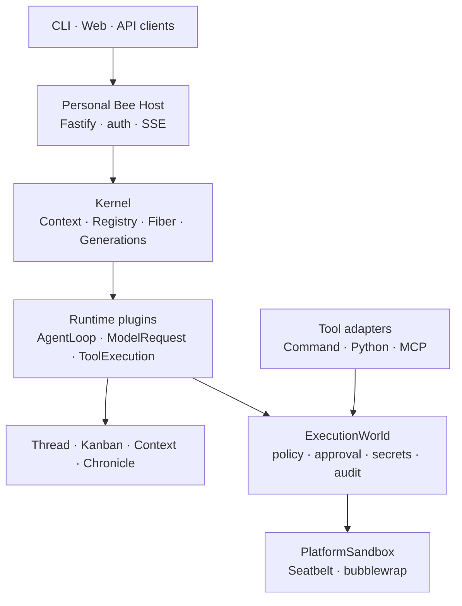

<p align="center">
  
</p>

<h1 align="center">Bee Agent</h1>

<p align="center">
  <strong>Plugin-composed, traceable, sandboxed personal agent runtime</strong>
</p>

<p align="center">
  English | <a href="./README-ZH.md">简体中文</a>
</p>

## Project status

Bee Agent v1 is under active development on `main`. It is a
clean break from the frozen `v0.11.0-legacy` line: there is no compatibility
facade for the old TaskRuntime, plugin SDK, process tools, storage modes, or
external-agent API.

The implemented foundation is a local-first Personal Bee Host with:

- a Cordis-derived Context–Registry–Fiber plugin runtime;
- versioned StructureGenerations, A/B/C reconciliation, and Turn-scoped leases;
- exact-version trusted PluginCatalog composition and config-source refresh;
- the Chronicle-backed Thread–Turn–Item protocol;
- a durable Kanban task plane;
- budgeted context and lazy Tool/Skill indexes;
- durable model requests and recoverable AgentLoop checkpoints;
- streaming model interaction (SSE with Retry-After backoff), thread-wide
  conversation continuity, a memoized system prompt, and two-level context
  compaction (tool-result elision plus durable summarization) that folds the
  model-visible view without ever rewriting the log;
- parallel-safe tool dispatch with ordered commit and fail-closed
  concurrency defaults;
- a keyless recorded-session replay harness pinning the exact model-visible
  requests and Chronicle streams across refactors;
- a deny-by-default ExecutionWorld with approval, secret, sandbox, audit, and
  idempotency boundaries;
- sandboxed Command, Python, and manifest-pinned MCP adapters;
- personal memory: Claim/Observation contracts, embedded recall and near-line
  derivation, `/memory` governance routes, and remote memories behind a
  circuit breaker with durable health events;
- a versioned world model: facts enter only through sourced projectors,
  rebuilds are digest-verified, with read-only `GET /world` and
  `GET /structure` lineage views;
- trajectory replay: per-Turn causal projections and digest-verified replay
  of the exact model-visible context;
- long-running work: a durable scheduler (time, Kanban-condition, and event
  triggers) continuing threads across days with fire-once catch-up;
- a unified personal data directory backing every durable artifact by
  default.

The authoritative design and implementation status live in
[`docs/architecture`](./docs/architecture); architectural decisions live in
[`docs/adr`](./docs/adr); the HTTP API reference lives in
[`docs/api.md`](./docs/api.md).

## Architecture



The kernel owns live plugin composition. Chronicle owns durable facts. A Turn
pins one StructureGeneration, so a configuration change cannot swap its model,
tools, policies, or AgentLoop halfway through execution.

External effects follow one route:

```text
tool intent
  → ToolAdapter.describe()
  → canonical ActionRequest
  → deny / ask / allow
  → durable approval
  → late-bound secrets
  → enforcing SandboxProvider
  → snapshot / execute / diff / verify
  → durable result
  → ToolAdapter.present()
```

Only `packages/execution` may import Node process-spawn APIs. Static boundary
checks enforce this repository-wide.

## Current capabilities

| Area              | Status      | Current implementation                                                                                                                                                                                                                                                                                                                                                             |
| ----------------- | ----------- | ---------------------------------------------------------------------------------------------------------------------------------------------------------------------------------------------------------------------------------------------------------------------------------------------------------------------------------------------------------------------------------- |
| Kernel            | Available   | Proxy Context, scoped services, `inject`, Registry/Fiber lifecycle, owned effects, scopes, A/B/C reconcile with rollback, leases, quarantine and Doctor                                                                                                                                                                                                                            |
| Structure         | Available   | Verified EffectiveStructure digest, trusted exact-version PluginCatalog, factory registry, config-source refresh, serialized reconcile, lifecycle facts and restart rebuild                                                                                                                                                                                                        |
| Conversation      | Available   | Chronicle-backed Thread–Turn–Item commands, SSE replay/resume, approval suspension/resume, cancellation, checkpoint recovery; thread-wide conversation continuity (prior turns carried into each new one)                                                                                                                                                                          |
| Tasks             | Available   | Durable Kanban state machine, dependencies, claim/lease/heartbeat, dispatcher recovery, REST/SDK/CLI/Web views                                                                                                                                                                                                                                                                     |
| Context           | Available   | ContextManifest, budget allocation, protected sections, omission records, Tool/Skill indexing and lazy resolution, token baseline gate; two-level compaction of the model-visible view — tool-result elision under a budget (errors and the recent window protected) and durable LLM summarization with digest-verified `context.compacted` events and a per-turn attempt breaker  |
| Models            | Available   | OpenAI-compatible LLMRuntime with real SSE streaming (deltas as chunks, streamed tool-argument assembly, JSON fallback, header-only timeouts), Retry-After-aware backoff, tool-argument validation surfaced to the model, output-cap escalation on `max_tokens`, durable ModelRequestService with digest-checked recovery                                                          |
| Execution         | Available   | ActionRequest, full permission-intersection snapshots, durable approvals, idempotency/reconciliation, system credentials, artifact scanning, routing sandboxes and snapshots/diffs; concurrency-classified tool dispatch — parallel-safe bounded batches, exclusive ordering, results committed in model order, suspended/crashed steps finish their remaining calls               |
| Platform sandbox  | Available   | macOS Seatbelt and Linux bubblewrap providers, mandatory Ubuntu contracts, empty child environment, process-group cancellation and timeout/input/output bounds                                                                                                                                                                                                                     |
| Command tool      | Available   | Opt-in `command_run`; Host allowlists native executables and a canonical workspace                                                                                                                                                                                                                                                                                                 |
| Python tool       | Available   | Opt-in `python_run`; fixed native interpreter, bounded JSON stdin, explicit runtime read roots                                                                                                                                                                                                                                                                                     |
| MCP tools         | Available   | Opt-in `mcp__<server>__<tool>`; Host-pinned manifests and staged JSON-lines initialize/call sessions                                                                                                                                                                                                                                                                               |
| Storage           | Available   | SQLite Chronicle and Kanban adapter; PostgreSQL/pgvector from v0 were removed during the clean break                                                                                                                                                                                                                                                                               |
| External agents   | Optional    | Bounded delegation, parent/child trajectory lineage, exact-origin network sandbox and declarative RemoteAgent v2                                                                                                                                                                                                                                                                   |
| Memory            | In progress | MemoryProvider contract and contract suite; embedded memory-bee (Chronicle projection, lexical recall, preference/correction derivation, consolidation); recall hook and near-line derivation wired into the Host with `/memory` view/forget/export governance; remote-memory circuit breaker, explicit degradation, and the HTTP transport (`BEE_AGENT_MEMORY_REMOTE_URL`) landed |
| World model       | In progress | Entities, provenance-carrying relations, and versioned snapshots over a `world` Chronicle stream with digest-verified rebuilds; facts enter only through sourced projectors (tool usage, execution resources); Host catch-up plus live projection with a read-only `GET /world` view; StructureGraph lineage via `GET /structure`                                                  |
| Trajectory replay | In progress | `GET /threads/:id/turns/:turnId/trajectory` projects a Turn's causal chain (generation structure versions and model-input digests, tool authorization decisions and outcomes, checkpoints); `GET /model-requests/:id/replay` returns the exact model-visible context; checkpoint fork pending                                                                                      |
| Long-running      | In progress | Durable AgentScheduler: one-shot, recurring, and condition triggers (Kanban task status with durable catch-up, edge-triggered events) continuing a bound thread across days and restarts; missed intervals collapse into one catch-up run resuming the original cadence; `/scheduler` trigger management and manual tick; the daemon form pending                                  |
| Learning          | Planned     | Package boundaries exist; the Phase 5 implementation is not yet an active Host capability                                                                                                                                                                                                                                                                                          |

## Requirements

- Node.js 22 or newer
- pnpm 10
- macOS with `/usr/bin/sandbox-exec`, or Linux with bubblewrap, for external
  process tools; unavailable isolation fails closed

## Build and verify

```bash
pnpm install
pnpm build
pnpm typecheck
pnpm lint
pnpm format:check
pnpm test
```

## Start the Host

The Host requires an OpenAI-compatible model. A session token is generated and
logged when omitted; set one explicitly when also starting CLI/Web clients.

```bash
export BEE_AGENT_MODEL_API_KEY='<key>'
export BEE_AGENT_MODEL_NAME='<model>'
export BEE_AGENT_MODEL_BASE_URL='https://api.deepseek.com'
export BEE_AGENT_SESSION_TOKEN='local-development-token'
# optional: replace the default Bee system prompt wholesale
# export BEE_AGENT_SYSTEM_PROMPT='Your instructions here'

pnpm --filter @bee-agent/bee start
```

The default address is `http://127.0.0.1:3000`. Binding a non-loopback address
without `BEE_AGENT_SESSION_TOKEN` is rejected. Both the Host and the CLI
auto-load `apps/bee/.env` (see `apps/bee/.env.example`); the full
environment-variable quick reference lives in
[`docs/api.md`](./docs/api.md#环境变量速查).

Use the CLI:

```bash
export BEE_AGENT_URL='http://127.0.0.1:3000'
pnpm --filter @bee-agent/cli build

pnpm --filter @bee-agent/cli bee -- chat
pnpm --filter @bee-agent/cli bee -- thread create --title 'Research'
pnpm --filter @bee-agent/cli bee -- kanban list
```

Run the Web client:

```bash
VITE_BEE_AGENT_URL='http://127.0.0.1:3000' \
VITE_BEE_AGENT_SESSION_TOKEN="$BEE_AGENT_SESSION_TOKEN" \
pnpm --filter @bee-agent/web dev
```

## Optional external tools

All external tools are absent from EffectiveStructure and model context unless
explicitly configured.

### Command

```bash
export BEE_AGENT_COMMAND_EXECUTABLES='/bin/echo,/usr/bin/git'
export BEE_AGENT_COMMAND_WORKSPACE="$PWD"
export BEE_AGENT_COMMAND_MAX_TIMEOUT_MS=30000
export BEE_AGENT_COMMAND_MAX_OUTPUT_BYTES=1048576
```

Entrypoints must be native executables. For a script, allowlist its native
interpreter and pass the script as argv.

### Python

```bash
export BEE_AGENT_PYTHON_EXECUTABLE='/absolute/path/to/native/python3'
export BEE_AGENT_PYTHON_WORKSPACE="$PWD"
export BEE_AGENT_PYTHON_RUNTIME_READ_PATHS='/absolute/path/to/python/runtime'
export BEE_AGENT_PYTHON_MAX_INPUT_BYTES=1048576
export BEE_AGENT_PYTHON_MAX_TIMEOUT_MS=30000
export BEE_AGENT_PYTHON_MAX_OUTPUT_BYTES=1048576
```

Runtime paths are a comma-separated, Host-controlled read-only allowlist for
the interpreter's standard library and native modules. On macOS, do not use
the `/usr/bin/python3` developer-tools shim as the configured executable.

### MCP stdio

`BEE_AGENT_MCP_MANIFESTS` is a JSON array. Tool schemas and all executable,
path, secret, and resource scope are pinned by the Host; startup performs no
implicit, unapproved discovery.

```bash
export BEE_AGENT_MCP_MANIFESTS='[{"name":"local","protocolVersion":"2024-11-05","executable":"/absolute/path/to/native/node","arguments":["/workspace/server.mjs"],"workspaceRoot":"/workspace","runtimeReadPaths":["/absolute/path/to/node/runtime"],"readPaths":["server.mjs"],"writePaths":[],"tools":[{"name":"lookup","description":"Look up local data","inputSchema":{"type":"object","properties":{"query":{"type":"string"}},"required":["query"],"additionalProperties":false}}]}]'
```

The current PlatformSandbox denies network access and does not support network
allowlists, so only networkless stdio servers are enabled.

## Repository structure

```text
apps/
  bee/                    Personal Bee Host and composition root
  cli/                    Thread/Kanban CLI on @bee-agent/client
  web/                    React conversation and Kanban console
packages/
  kernel/                 Context–Registry–Fiber + StructureGeneration
  knowledge/              Chronicle contracts and durable schemas
  thread/                 Thread–Turn–Item protocol
  kanban/                 Durable task plane
  context/                Context budgets and lazy Tool/Skill indexes
  execution/              Authorization, secrets, sandbox and audit pipeline
  runtime/                AgentLoop, ModelRequest and ToolExecution plugins
  model-providers/         OpenAI-compatible LLM provider
  client/                 REST/SSE client SDK
  storage/                Storage primitives
adapters/
  storage/sqlite/          Chronicle and Kanban SQLite implementation
  tools/command/           command_run declaration
  tools/python/            python_run declaration
  tools/mcp/               manifest-pinned MCP stdio declarations
plugins/
  memory-bee/              Default embedded memory provider (memory stream
                          projection, recall and derivation)
  memory-remote/           Remote memory seam: bridge transport plus a
                          circuit-breaker provider with durable health events
```

## Roadmap

- [x] Phase 1: clean-break kernel, Chronicle, Thread–Turn–Item and Host
- [x] Phase 2: durable Kanban, context budgets and lazy Tool/Skill resolution
- [x] Phase 3: ExecutionWorld, permission snapshots/approvals, system
      credentials, Seatbelt/bwrap, Command/Python/MCP, worktrees, bounded
      delegation and RemoteAgent v2
- [x] Phase 4: memory, world model and long-running workflows — the memory
      contract, embedded recall/derivation, governance routes, remote
      degradation with the HTTP transport, world-model and StructureGraph
      projections, trajectory replay, the time/condition scheduler, and the
      unified personal data directory; the MCP memory transport variant,
      checkpoint fork, and daemon form move to the backlog
- [ ] Phase 5 (in progress): background learning and governed improvement — the four-stage slow loop and ImprovementProposal governance (/learning routes + background cadence) have landed; ExperimentWorld, autonomy-level activation, and anti-fake-improvement evaluation remain
- [ ] Phase 6: experience convergence and v1 release

## License

Bee Agent is released under the [MIT License](./LICENSE).
