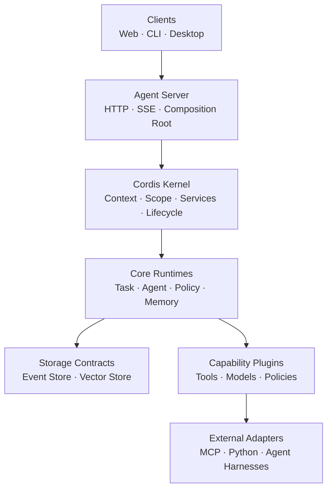

<p align="center">
  
</p>

<h1 align="center">Bee Agent</h1>

<p align="center">
  <strong>Modular, Traceable, Extensible Agent Platform — Engineering Preview</strong>
</p>

<p align="center">
  <a href="https://github.com/darifo/bee-agent/actions/workflows/ci.yml">
    
  </a>
  <a href="LICENSE">
    
  </a>
  <a href="https://nodejs.org/">
    
  </a>
  <a href="https://www.typescriptlang.org/">
    
  </a>
  
</p>

---

## Overview

Bee Agent is an open-source TypeScript platform for composing agent runtimes,
tools, policies, storage adapters, and external workers without coupling them to
one monolithic core. It is designed around explicit lifecycle management,
append-only execution history, stable plugin contracts, and interchangeable
infrastructure.

The project aims to support coding, research, office automation, data analysis,
and content workflows through a shared runtime that can be inspected, tested,
paused, resumed, and extended.

## Why Bee Agent?

- **Modular by design** — runtime capabilities live behind package and plugin
  boundaries instead of accumulating in a single core.
- **Traceable execution** — task events are append-only, ordered, and replayable.
- **Lifecycle safety** — Cordis contexts and scopes manage services, effects, and
  task-scoped resource cleanup.
- **Storage portability** — domain contracts keep SQLite and PostgreSQL details
  out of runtime code.
- **Schema-first contracts** — Zod schemas provide runtime validation and strict
  TypeScript types across packages.
- **Extensible capabilities** — the architecture reserves clean boundaries for
  tools, policies, models, MCP integrations, Python workers, and external agents.

## Architecture



The clients, server, and core agent loop shown above are planned layers. The
kernel, contracts, storage abstractions, and SQLite Event Store are implemented
today.

## Current capabilities

| Area                 | Status    | Details                                                                                  |
| -------------------- | --------- | ---------------------------------------------------------------------------------------- |
| Monorepo toolchain   | Available | pnpm workspaces, strict TypeScript, ESLint, Prettier, Vitest, Changesets, and CI         |
| Shared contracts     | Available | Task, event, tool, approval, memory, embedding, vector-search, API, and SSE schemas      |
| Cordis kernel        | Available | Root context, service registration, task scopes, effects, and resource cleanup           |
| SQLite storage       | Available | Migration, transactions, rollback, append-only events, atomic task sequences, and replay |
| PostgreSQL storage   | Planned   | Plugin boundary and ADR are defined; implementation is deferred                          |
| pgvector memory      | Planned   | Vector Store contract and plugin boundary are defined; search is deferred                |
| Server, CLI, and Web | Planned   | Application directories are reserved for later stages                                    |

## Requirements

- [Node.js](https://nodejs.org/) 22 or newer
- [pnpm](https://pnpm.io/) 10

## Quick start

Clone the repository and install its dependencies:

```bash
git clone git@github.com:darifo/bee-agent.git
cd bee-agent
pnpm install
```

Run the full local verification suite:

```bash
pnpm build
pnpm typecheck
pnpm lint
pnpm test
```

There is no runnable server command yet. This checkout currently serves as the
tested foundation for the next implementation stages.

## Repository structure

```text
bee-agent/
├── apps/                    # Server, CLI, and Web composition roots
├── packages/
│   ├── contracts/           # Zod schemas and shared domain/transport types
│   ├── plugin-sdk/          # Public plugin manifest and lifecycle contract
│   ├── kernel/              # Cordis root context and task-scope wrapper
│   ├── storage/             # Storage and transaction boundaries
│   ├── event-store/         # Append-only Event Store contract
│   └── vector-store/        # Vector Store and embedding-space boundary
├── plugins/
│   ├── storage/sqlite/      # Working SQLite storage and Event Store
│   ├── storage/postgres/    # Reserved PostgreSQL adapter boundary
│   └── vector/pgvector/     # Reserved pgvector adapter boundary
├── adapters/                # Future external protocol and agent adapters
├── python/                  # Future Python worker projects
├── migrations/              # Dialect-specific database migrations
├── configs/                 # Environment configuration examples
├── tests/                   # Shared contract, integration, and E2E suites
└── docs/adr/                # Architecture Decision Records
```

## Development

| Command             | Purpose                                           |
| ------------------- | ------------------------------------------------- |
| `pnpm build`        | Build all implemented workspace packages          |
| `pnpm typecheck`    | Run strict TypeScript checks across the workspace |
| `pnpm lint`         | Run ESLint                                        |
| `pnpm test`         | Run all package tests                             |
| `pnpm format`       | Format supported files with Prettier              |
| `pnpm format:check` | Verify formatting without modifying files         |
| `pnpm changeset`    | Describe a package-level release change           |

### Workspace rules

- Import other workspaces only through their package exports; never import their
  internal `src/` paths.
- Keep core packages independent of concrete plugins.
- Keep database-specific behavior inside storage adapters.
- Give every package and plugin its own manifest and public boundary.
- Add tests for public contracts and lifecycle-sensitive behavior.

## Database model

SQLite is the only working database adapter at this stage. Its Event Store uses
a transaction and a per-task sequence row to allocate monotonically increasing
event sequences. It does not use an unsafe `MAX(sequence) + 1` allocation.

SQLite and PostgreSQL are separate runtime modes: Bee Agent will never dual-write
to both databases. Vector data is also kept outside task event tables through a
dedicated Vector Store contract.

## Roadmap

- [x] Initialize the pnpm TypeScript monorepo and quality toolchain
- [x] Define shared contracts and plugin SDK boundaries
- [x] Implement the Cordis kernel and task-scope cleanup
- [x] Implement and test the SQLite Event Store
- [ ] Add the task state machine, policy engine, calculator tool, and mock agent
- [ ] Add the HTTP/SSE server, Client SDK, and CLI
- [ ] Add the React Web UI
- [ ] Implement PostgreSQL using the shared storage contract suite
- [ ] Implement pgvector and embedding-space validation
- [ ] Add memory, real model providers, MCP, Python workers, and external agents

Architecture decisions and their constraints are recorded in
[`docs/adr`](./docs/adr).

## Contributing

Contributions are welcome while the architecture is taking shape.

1. Open an issue to discuss substantial behavior or public API changes.
2. Fork the repository and create a focused branch.
3. Add or update tests with your change.
4. Run `pnpm build`, `pnpm typecheck`, `pnpm lint`, and `pnpm test`.
5. Submit a pull request describing the motivation, behavior, and trade-offs.

Please keep changes within package boundaries and record significant
architectural decisions as ADRs.

## License

Bee Agent is available under the [MIT License](./LICENSE).
