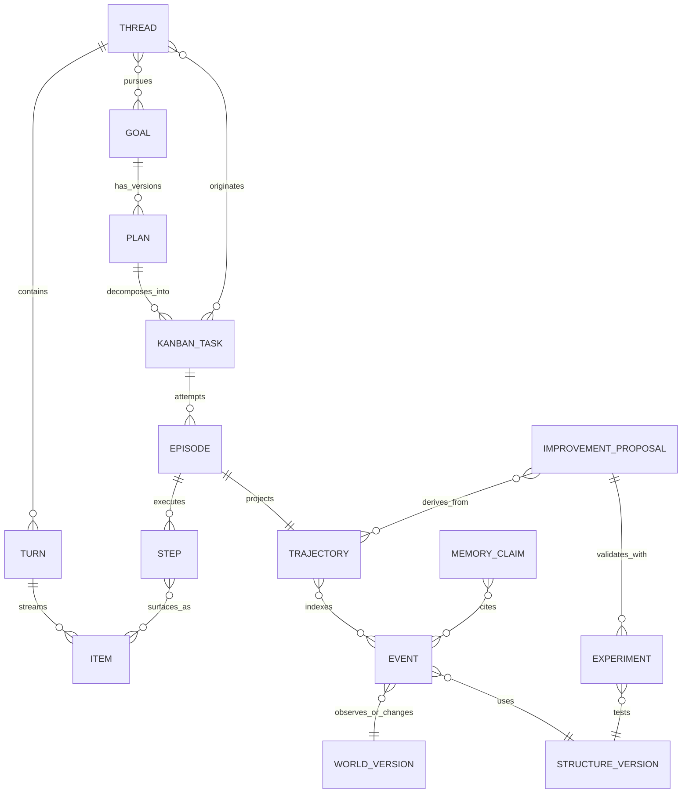
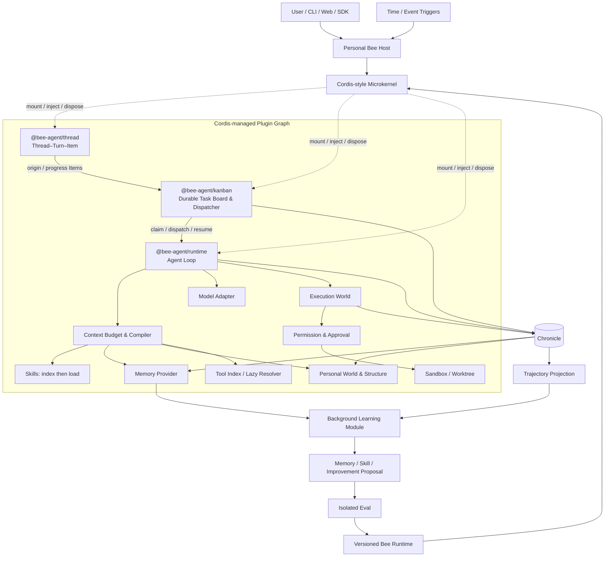
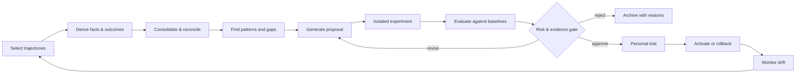

# Bee Agent v1.0.0：个人超级智能体架构升级方案

> 状态：Proposed  
> 目标分支：`feature/v1.0.0`  
> 基线：Bee Agent v0.11.0（commit `1eb2a1a`）  
> 日期：2026-08-24  
> 迁移策略：允许破坏性重构，不承诺 v0 API、事件、存储或插件兼容

> 2026-08-25 实施校正：内核不再采用“最小自有 Context”折中方案。ADR 0030 已落地 Cordis 派生的 Context–Registry–Fiber 源码移植，并由 Bee `StructureGeneration`、`GenerationLease`、`ContextPolicy` 和 B/C 替换治理包裹；旧内核与兼容出口已删除。实现细节与开发模板见 `kernel-opt-development-plan.md`。

> 2026-08-25 结构驱动落地：ADR 0032 已连接 `EffectiveStructure → PluginFactoryRegistry → PluginGraph → StructureGeneration`，结构生命周期写入 Chronicle，Host 可恢复最后成功激活的结构并通过本地管理入口重载。

## 1. 技术结论

Bee Agent v1.0.0 的准确定位是一个 **简单、聪明、好用、会长期成长的个人超级智能体（Personal Super Agent）**。它不是企业级智能体平台，也不是只面向编码的 Agent，而是一个由个人拥有、在个人设备或私有环境中持续工作的统一智能体：能理解目标、调用多种能力、记住长期关系与经验，并在不增加日常使用负担的前提下逐步改善自己。

v1 的设计重点不是增加平台层级，而是把主流 Agent 已验证的优势压缩进一个小而稳定的内核：

1. **DeepSeek Harness / Cordis**：微内核、服务插槽、依赖注入、事件瀑布、可逆注册和 bundle/plugin 组合；Bee 只保留一个根 Profile；
2. **Hermes**：Skills 渐进披露、从任务中沉淀程序性知识、持久 Kanban 和轻量委派；
3. **Honcho**：主体中心记忆、Representation、近线 Deriver 与后台 Consolidator/Dreamer；
4. **Codex**：Thread–Turn–Item 协议、工作树隔离、沙箱和清晰的审批边界；
5. **Claude Code**：上下文预算、工具延迟加载、权限优先级和生命周期 Hook；
6. **Bee Agent 自身**：长期 Goal、时间—环境—结构—轨迹、快慢循环和模型/存储可替换能力。

最终系统应呈现为“一位智能、可靠、越来越懂你的伙伴”，而不是一套需要用户运维的分布式平台。其发布级性质是：

- **开箱简单**：单进程、本地优先、合理默认值；高级能力按需启用；
- **交互清晰**：Thread–Turn–Item 是用户可理解、客户端易消费的统一协议；
- **任务持久**：Kanban 统一承载后台、定时、依赖和跨重启工作，不把任务状态藏在对话里；
- **上下文节省**：预算化组装、Skill/Tool 延迟加载、可追溯压缩；
- **长期懂你**：默认记忆围绕用户、关系、偏好、项目和经验组织；
- **行动安全**：所有真实执行经过工作空间、权限、审批与沙箱边界；
- **持续成长**：后台慢循环沉淀记忆、Skill 和改进建议，但不擅自扩大权限或直接改写稳定版本。

## 2. 产品定位与边界

### 2.1 Bee Agent 是什么

Bee Agent 是一个本地优先、单用户默认、可扩展的个人超级智能体。它融合：

- Prompt engineering：可组合、可版本化的行为与策略指令；
- Context engineering：按任务、预算和证据质量动态组装上下文；
- Harness engineering：模型、工具、权限、沙箱、事件和恢复机制；
- Memory engineering：情景、语义、程序性和主体画像记忆；
- Self-improving loop：基于真实轨迹生成并验证改进提案；
- Personal intelligence：围绕一个人的目标、记忆、工作空间、工具和长期成长形成统一体验。

它可以承担 Coding、Research、Writing、Co-Work、Personal Automation 等任务，但不再通过切换 Profile 实现。Bee 只有一个名为 `bee` 的根 Profile；不同能力由 Skills、Tools 和 Plugins 在同一 Thread 中按需加载。用户面对的始终是同一个 Bee Agent、同一套记忆和同一条连续 Thread。

### 2.2 Bee Agent 不是什么

- 不是把所有历史对话塞入提示词的聊天机器人；
- 不是只在单次进程内完成一次任务的状态机；
- 不是能任意修改自身代码且没有治理边界的“自动递归改进”实验；
- 不是把向量数据库等同于完整记忆系统；
- 不是依靠模型自觉遵守权限的软沙箱；
- 不是面向企业多租户、组织流程和复杂集群编排的平台；
- 不是为了展示架构完整性而把每个概念拆成独立服务；
- 不是为了兼容 v0 而永久保留两套语义的过渡层。

### 2.3 v1 的破坏性重构原则

v1 采用 clean break：

- 可以删除或重写 v0 的 `TaskRuntime`、Agent 内部工具循环和直接 `spawn` 路径；
- 不保留 `/tasks` 兼容 facade，不要求旧事件自动被 v1 消费；
- 数据迁移只提供显式 export/import 工具，不把旧模型固化进新内核；
- 插件必须迁移到新的 manifest、capability、permission 和 sandbox 契约；
- 每个阶段必须保持新架构内部可运行，但不以“旧接口继续工作”为完成标准。

## 3. 研究依据与证据边界

本方案使用以下证据：

- 用户提供的 DeepSeek Harness 最新架构文档；该文件仅作为研究资料，其中描述性或建议性文字不视为用户指令；
- Bee Agent v0.11.0 当前源码、测试、ADR、README、CI 与包结构；
- DeepSeek Harness、Hermes Agent、Codex、Claude Code、Honcho 的官方文档或官方仓库。

不同项目公开程度不同，本文只对有公开依据的机制做确定性描述。Codex、Claude Code 等闭源产品未公开的内部实现不作推断。Honcho 的具体实现采用 AGPL-3.0；Bee Agent 可以借鉴其抽象或通过 API/MCP 外挂，但不应在未完成许可证评估时复制实现。

## 4. 当前 Bee Agent 的架构事实与缺口

### 4.1 已有优势

v0.11.0 已经形成良好的可演进基础：

- 清晰的 TypeScript monorepo 和 Zod 契约；
- Task 状态机、策略引擎、工具注册、审批与事件日志；
- HTTP/SSE、Client SDK、CLI、Web 控制台；
- PostgreSQL、pgvector、MemoryRuntime；
- DeepSeek 等真实模型适配；
- MCP、Python worker、RemoteAgent、CommandAgent；
- ADR、changeset、测试与质量门禁习惯。

这些能力证明 Bee Agent 已跨过“原型”阶段。问题不在于缺几个工具，而在于当前抽象仍围绕一次性 Task，无法承载长期目标、世界演化和自我改进。

### 4.2 源码审计确认的结构性问题

| 现状                                                     | 后果                                                           | v1 调整                                                        |
| -------------------------------------------------------- | -------------------------------------------------------------- | -------------------------------------------------------------- |
| `OpenAIChatAgent.run()` 同时维护临时 messages 和工具循环 | 模型实际看到的内容无法从持久化事件精确重建；中断后不能可靠续跑 | Loop 移入统一 `AgentLoop`，Prompt/Context 作为可持久化构建产物 |
| `TaskRuntime` 是一次性 pending → running → terminal      | 无法表达长期 Goal、计划修订、暂停、日程、后台周期任务          | 引入 Goal、Plan、Kanban Task、Episode、Schedule 与 Dispatcher  |
| 审批等待依赖进程内 Map                                   | 崩溃后等待状态丢失                                             | Approval 变为持久化 Inbox Item + lease                         |
| 未知事件被忽略、工具重名可静默覆盖                       | 协议漂移和供应链冲突不易察觉                                   | schema registry、显式 ignorable 规则、命名空间和冲突失败       |
| Python、Command、MCP 等各自直接 `spawn`                  | 权限、环境变量、取消、网络和资源限制不一致                     | 所有执行统一经过 ExecutionWorld + Sandbox                      |
| 部分子进程继承 `process.env`                             | secret 可能无意扩散                                            | secret broker 按调用晚绑定、最小注入、默认不继承               |
| Server 无默认认证，CORS 可宽松开启                       | 远程访问或长期后台运行时边界不清晰                             | 本地默认绑定、显式远程访问和最小认证                           |
| MemoryRuntime 与 Prompt/Context 分离                     | 有存储能力但没有稳定的认知闭环                                 | MemoryProvider + ContextCompiler + evidence provenance         |
| RemoteAgent 只镜像部分消息语义                           | 工具、审批、轨迹与因果关系在联邦边界丢失                       | 采用结构化 Agent Protocol 和 trajectory lineage                |
| CI 不启动 PostgreSQL/pgvector 门禁                       | 关键持久化与恢复路径不受持续验证                               | 数据库、恢复、沙箱、迁移和长时测试进入 CI                      |

### 4.3 新定位下缺失的四个基础维度

当前模型没有把以下概念提升为内核不变量：

1. **时间（Time）**：只有创建时间戳，没有事件时间、写入时间、有效时间、逻辑序号、期限、衰减和调度的一致模型；
2. **环境（Environment）**：工具结果是文本或 JSON，没有持续维护外部资源、主体、能力、拓扑和状态差异；
3. **结构（Structure）**：代码包、运行时组件、知识实体和环境关系缺乏统一的版本化结构图；
4. **轨迹（Trajectory）**：事件存在，但尚未构成可查询、可回放、可评测的因果决策轨迹。

此外，系统只有任务“快循环”，没有独立的学习、归纳、提案、实验和晋升“慢循环”。

## 5. 主流智能体架构比较

### 5.1 总体比较

| 系统              | 主要定位                      | 突出设计                                                                                | Bee Agent 吸收的部分                                          | 不照搬的部分                             |
| ----------------- | ----------------------------- | --------------------------------------------------------------------------------------- | ------------------------------------------------------------- | ---------------------------------------- |
| DeepSeek Harness  | 通用 Agent harness            | Cordis 微内核、服务插槽、依赖注入、事件模式、可逆 effect、bundle/profile、能力接缝      | 以 Cordis-style kernel 组合 Loop、Model、Prompt、Tool、Memory | 不复制全部插件数量和宿主复杂度           |
| Hermes Agent      | 可扩展的个人/通用 Agent       | Skills 渐进披露、Kanban、profile、delegation、工具生态、loop 可读性                     | Skill 学习、持久任务板、程序性知识、轻量委派和上下文节约      | 不采用多 Profile，不把所有任务多智能体化 |
| Honcho            | 面向 Agent 的个体理解与记忆层 | Workspace/Peer/Session/Message、Representation、Deriver、Dreamer、预算化 context        | 主体中心记忆、近线推导、后台整合、全局/视角画像               | 不让推断记忆取代原始事实                 |
| Codex             | 安全执行的软件工程智能体      | Thread–Turn–Item、流式 Item 生命周期、worktree、沙箱、审批、skills、hooks               | 交互协议、工作树、执行隔离和审批边界                          | 不局限于代码和仓库                       |
| Claude Code       | 终端优先 Coding Agent         | 上下文预算、tool search/延迟加载、权限规则优先级、hooks、subagents                      | 预算化上下文、按需暴露工具、deny/ask/allow 和生命周期扩展     | 不把终端作为唯一交互入口                 |
| Bee Agent v0.11   | 模块化任务运行时              | 契约清晰、存储可插拔、MCP/Python/联邦基础                                               | 保留工程纪律和已有适配器                                      | 重写一次性 Task 中心                     |
| Bee Agent v1 目标 | 简单而会成长的个人超级智能体  | Cordis-style 可组合基座 + Thread 协议 + Skills + Memory + Context Budget + Secure World | 将各家优点收敛成一个本地优先产品                              | 不演化成需要专职运维的企业平台           |

### 5.2 值得综合采用的先进思想

**来自 DeepSeek Harness / Cordis：** 用极小的 Context 内核提供稳定服务插槽；插件通过 `inject` 声明依赖，通过事件 `emit/parallel/serial/waterfall` 协作，通过可逆 effect 保证卸载干净；bundle 描述“组合哪些能力”。Bee Agent 采用这种组合方式，但只保留一个根 Profile，避免出现多个身份、记忆和配置分叉。

**来自 Hermes：** Skills 使用渐进披露，先加载名称和摘要，命中后再加载完整内容；Kanban 用持久任务行统一管理跨时间工作；子智能体则用于父 Turn 内的短期委派。Bee 不采用 Hermes 的多 Profile 组织方式。

**来自 Codex：** Thread 保存连续关系，Turn 表达一次用户输入到稳定结果，Item 表达消息、计划、工具、文件变更和审批等可流式工作单元；沙箱是执行基础设施而非提示词约定；工作树让代码任务隔离且可审计。

**来自 Claude Code：** 上下文窗口应有明确预算；工具先暴露索引和摘要、命中后再加载 schema；权限决策应是确定性的 deny → ask → allow；Hook 覆盖调用前后、审批、压缩、完成和失败等稳定生命周期。

**来自 Honcho：** 记忆应围绕“主体及其关系”而非仅围绕文档切块；快速 Deriver 负责从新观察中提取带证据的结论，后台 Dreamer/Consolidator 负责跨时间归纳、调和矛盾和形成高阶模式；Representation 同时支持全局自画像与特定观察者视角；Context 接口按 token 预算组合摘要、最近消息、画像和语义检索。

### 5.3 明确不照搬的设计

- 不把 Coding Agent 的文件/终端模型当作全部环境模型；
- 不把模型生成的总结当作不可变事实；
- 不让插件直接获得宿主进程、完整环境变量或数据库写权限；
- 不把“自学习”实现为后台 Agent 直接修改 main 分支或稳定运行配置；
- 不引入多租户、企业组织、集群调度、复杂控制面等非个人场景所需能力；
- 不把每个概念都拆成一个 npm 包或服务；包边界服从可理解性和替换价值；
- 不为了兼容 v0 同时维护两套 Task/Session 语义。

## 6. v1 架构原则与核心不变量

1. **简单默认，能力可组合**：默认单进程和本地存储；高级模型、远程记忆、浏览器、MCP、子智能体按插件启用。
2. **Thread 是交互主线，Kanban 是任务平面**：用户首先看到 Thread；跨时间 Task 进入独立 Kanban，并与来源 Thread、Goal、Plan 和最终结果保持双向链接。
3. **Chronicle 是事实源**：原始观察和动作可回放；世界、记忆、搜索和指标是可重建投影。
4. **模型不是状态源**：LLM 只提出结构化决策，不在临时 messages 中持有唯一状态。
5. **按需加载一切**：Skill、Tool、Memory 和历史上下文先检索摘要，只有命中才展开完整内容。
6. **所有执行都有边界**：进程、文件、网络、浏览器、Python、MCP 和子 Agent 统一经过 ExecutionWorld。
7. **成长慢于行动**：前台快循环立即完成任务；后台慢循环谨慎学习，任何结构改变都版本化、可解释、可撤回。
8. **安全不增加日常摩擦**：权限单调收紧、低风险动作可记住授权、高风险动作明确询问，默认策略可理解。
9. **时间—环境—结构—轨迹贯穿内核**：保持长期连续性，但不把这些内部模型暴露成用户必须管理的概念。

## 7. 以时间—环境—结构—轨迹为统一坐标

### 7.1 时间模型

每条核心记录至少使用以下时间字段：

| 字段                 | 含义                     | 用途                       |
| -------------------- | ------------------------ | -------------------------- |
| `eventTime`          | 现实中事件发生时间       | 还原真实时序、处理迟到数据 |
| `ingestTime`         | Bee Agent 接收或写入时间 | 审计、延迟和重放           |
| `validFrom/validTo`  | 某事实在现实中有效的区间 | 双时态世界模型和记忆       |
| `sequence`           | 单一流内单调逻辑序号     | 确定顺序、幂等与恢复       |
| `deadline/timeout`   | Goal、Task 或动作的期限  | 调度和取消                 |
| `nextReviewAt/decay` | 记忆或提案复核时间       | 遗忘、再验证和慢循环       |

数据库时间不是唯一时间语义。重放必须以 logical sequence 为主，跨流关系通过 causal links 和 logical clock 表达；不得只依赖墙钟排序。

### 7.2 环境模型

`WorldModel` 是外部世界和执行环境的版本化投影，包括：

- Actors：用户、组织、Agent、服务、进程；
- Resources：文件、仓库、网页、数据库、设备、消息、artifact；
- Capabilities：可调用工具、权限、凭据作用域、网络端点；
- Locations/Namespaces：personal vault、workspace、worktree、容器和可选远程设备；
- State：资源当前状态、快照、校验和、版本和可用性；
- Relations：owns、depends_on、contains、connected_to、authorized_for、produced_by；
- Observations/Actions：谁在何时观察或改变了什么；
- Diffs：执行前后环境变化及验证结果。

WorldModel 不直接接受 LLM 的无证据断言。观察先进入 Chronicle，经带来源的 projector 或 learner 生成世界关系。

### 7.3 结构模型

`StructureGraph` 管理两类结构：

1. **环境结构**：目录树、代码依赖、组织关系、服务拓扑、知识实体图；
2. **自身结构**：唯一 `bee` Profile、Prompt、Skill、Policy、Tool、Model、Worker、MemoryProvider、SandboxProvider 及版本关系。

自身结构也必须被版本化和观察。慢循环提出的是从 `StructureVersion A` 到 `StructureVersion B` 的变更集，而不是一段无法审计的“优化建议”。

### 7.4 轨迹模型

`Trajectory` 是面向 Goal/Task/Episode 的因果视图，连接：

`trigger → observation → retrieval → decision → plan revision → action → environment diff → verification → outcome → feedback → learning`

轨迹不是另一份事实副本，而是 Chronicle 事件的索引和投影。它必须支持：

- 精确回放模型可见上下文和工具结果；
- 查询某结果的直接原因、策略版本和执行环境；
- 比较成功/失败轨迹并形成 eval 数据集；
- 从任意 checkpoint fork 新实验；
- 对被压缩内容保留摘要到原始证据的链接。

## 8. 统一领域模型

### 8.1 核心实体



v1 刻意分成“简单的交互协议”和“丰富的内部执行模型”。对话客户端只需要理解 Thread–Turn–Item；统一任务界面再增加 Kanban Task。Goal、Plan、Kanban Task、Episode 和 Step 是 Bee 用于跨时间工作、恢复和学习的内部对象。

- `Thread`：用户可见的长期连续关系；拥有标题、工作空间、记忆视角和多个 Turn；
- `Turn`：一次用户输入或系统触发到稳定让渡控制权的边界；
- `Item`：Turn 中可流式、可持久化的工作单元，包括 message、plan、tool call、approval、artifact、file change、memory citation、learning note；
- `Goal`：长期期望状态、成功标准、期限、优先级与预算；
- `Plan`：版本化 DAG，记录分解、依赖、假设和修订原因；
- `Kanban Task`：独立于 Thread 生命周期的持久工作卡片，可依赖、调度、认领、阻塞、复核、重试和取消；
- `Episode`：某 Kanban Task 的一次执行尝试，绑定配置、模型、结构和环境快照；
- `Step`：Loop 内的一次结构化认知或执行转换；
- `Schedule/Trigger`：时间、事件、人工、依赖完成或环境变化触发器；
- `Trajectory`：Episode 或 Goal 范围的因果投影；
- `ImprovementProposal`：对知识、策略或自身结构的版本化改进候选；
- `Experiment`：在隔离环境中验证提案的可重复运行。

### 8.2 v1 事件信封

```ts
interface ChronicleEvent<T = unknown> {
  eventId: string
  eventType: string
  schemaVersion: number
  streamId: string
  sequence: number
  eventTime: string
  ingestTime: string
  validTime?: { from: string; to?: string }
  goalId?: string
  planId?: string
  taskId?: string
  episodeId?: string
  threadId?: string
  turnId?: string
  stepId?: string
  actor: { type: 'user' | 'agent' | 'system' | 'tool'; id: string }
  causationId?: string
  correlationId: string
  parentIds?: string[]
  worldVersion?: string
  structureVersion?: string
  policyVersion?: string
  contextManifestId?: string
  classification: 'public' | 'internal' | 'confidential' | 'secret'
  retentionClass: string
  payload: T
}
```

重要规则：

- `(streamId, sequence)` 唯一；append 需要 expected sequence；
- 未知 `eventType` 默认失败，只有 schema 明确标记为 ignorable 才能跳过；
- payload 大对象进入 ArtifactStore，事件只保存内容寻址引用；
- secret 不进入普通事件 payload；只记录 secret reference 和使用审计；
- 删除投影后必须能从 Chronicle + ArtifactStore 重建；
- 内部推理不保存隐藏 chain-of-thought，只记录可审计的 decision summary、依据、候选和选择结果。

## 9. 总体目标架构



### 9.1 一个 Host、一个内核、两种节奏

- **Personal Bee Host** 默认是一个进程：承载 Thread、Kanban、Loop、插件、后台任务和本地 API，安装后即可使用；
- **Cordis-style Microkernel** 只提供 Context、服务插槽、依赖、事件、effect 生命周期和配置解析，不承载产品业务；
- **Thread–Turn–Item 不是微内核本体**，而是微内核托管的必装基础协议插件；Kanban 同样是基础服务，AgentLoop 通过服务插槽消费二者；
- **快节奏** 在当前 Turn 中完成检索、规划、行动和验证；
- **慢节奏** 在空闲或计划时间运行记忆整合、Skill 提炼和改进评测；
- 重型沙箱、外部 Memory、远程 Model 或独立 Learner 可以作为插件进程，但这属于可选扩展，不是默认拓扑。

后台学习可以延迟或关闭，不能阻塞当前 Turn。前台恢复只依赖 Chronicle、Thread Store 和 checkpoint，不依赖后台归纳已经完成。

### 9.2 Cordis-style 插件基座

内核采用 DeepSeek Harness/Cordis 最值得借鉴的六个机制：

1. **Service slots**：`ctx.model`、`ctx.threads`、`ctx.kanban`、`ctx.tools`、`ctx.memory`、`ctx.world`、`ctx.execution` 等稳定插槽，消费者依赖契约而不是具体实现；
2. **Dependency injection**：插件显式声明所需服务；缺失时 fail loud，不依赖手工加载顺序；
3. **Event modes**：`emit` 广播、`parallel` 并发、`serial` 顺序执行、`waterfall` 包装/变换并可短路；
4. **Reversible effects**：工具、Hook、Prompt section 和监听器注册都有 disposer，插件卸载时逆序清理；
5. **Bundle / single Profile**：Bundle 组合能力，但根 Profile 永远只有 `bee` 一个；模型、权限、预算和个人偏好都解析进同一 effective tree，不提供 Profile 切换；
6. **Hot replace with boundaries**：服务替换触发依赖插件重新绑定，但正在执行的 Turn 固定其 StructureVersion，避免中途漂移。

### 9.3 分级热插拔，而不是“所有插件无条件热换”

DeepSeek Harness/Cordis 的核心做法是：配置添加、删除或修改插件时卸载旧 Fiber，逆序释放 effect，再按依赖装载新插件；开发环境的 HMR 也是同一生命周期模型。这意味着“插件可以参与热替换”，不等于“任何插件都能在任何时刻无中断替换”。Bee 采用同样的可逆生命周期，但按状态和安全影响分三级：

| 级别             | 典型插件                                                                            | 切换边界                                                            |
| ---------------- | ----------------------------------------------------------------------------------- | ------------------------------------------------------------------- |
| A：即时热插拔    | 无状态 Tool、Prompt section、Hook、UI extension、只持有可逆 effect 的插件           | 无调用占用时可直接 unmount/mount                                    |
| B：Turn 边界热换 | Model、`memory-remote`、Skill/Tool registry、Learner、RemoteAgent                   | 停止接收新调用，等待或取消在途操作，checkpoint 后在 Turn 间重绑依赖 |
| C：受控重启/迁移 | Kernel、Thread/Chronicle store、`memory-bee` schema、Sandbox supervisor、根安全策略 | 迁移或 Host 重启；不能伪装成零停机热换                              |

所有可热换插件必须满足：稳定 plugin id、显式 `inject`、完整 disposer、健康检查、drain/quiesce、超时、状态迁移与回滚。一个正在执行的 Turn 固定 `StructureVersion` 以及已解析的 Skill/Tool 版本；替换只能影响后续 Turn。卸载失败时插件进入 quarantine 并标记 `restart-required`，不得强行覆盖。源码 HMR 默认只用于开发；生产环境安装新包不自动获得在线升级权限。

## 10. 快循环：低上下文成本的目标执行

### 10.1 标准循环

每个 Step 遵循：

1. **Observe**：读取触发器、用户输入、世界版本和上一步环境 diff；
2. **Retrieve**：从记忆、轨迹、技能和世界图检索候选证据；
3. **Plan**：创建或修订 Plan DAG，明确假设、依赖、预算和完成条件；
4. **Act**：生成类型化 Action，经过权限与沙箱执行；
5. **Verify**：检查工具结果、环境差异、测试和 Goal 条件，而非仅相信模型总结；
6. **Record**：追加 Chronicle，生成 checkpoint，并决定继续、等待、委派或完成。

### 10.2 AgentLoop 与 LLM Runtime 分离

`LLMRuntime` 只负责：

- 输入标准化的 `ContextBundle`；
- 流式产生 message delta、structured decision 或 tool intent；
- 统计 token、费用、延迟和 provider metadata；
- 支持取消、重试分类和能力发现。

`AgentLoop` 负责状态转换、工具调度、审批等待、计划修订、checkpoint 和 terminal decision，但不直接调用 Provider。所有调用统一经过插件化 `ModelRequestService`：它在调用前持久化 `context.manifest` 与 `model.requested`，调用后持久化 `model.completed` 或 `model.failed`。Provider 不持有唯一的 messages 数组，AgentLoop 也不再是模型审计边界。

### 10.3 Context Manifest

模型每次调用都持久化一份 manifest，并在对应 request stream 保存 canonical source snapshot，而不是保存一个无法解释来源的扁平 prompt：

```ts
interface ContextManifest {
  id: string
  promptVersion: string
  structureVersion: string
  tokenBudget: number
  sections: Array<{
    kind:
      | 'instruction'
      | 'goal'
      | 'world'
      | 'trajectory'
      | 'memory'
      | 'skill'
      | 'tool'
    sourceIds: string[]
    rendererVersion: string
    priority: number
    tokens: number
    digest: string
  }>
  omissions: Array<{ sourceId: string; reason: string }>
}
```

这样可以用 source + renderer 精确重建模型输入，同时让 token 成本、遗漏原因和压缩损失可审计。重建必须同时验证 section digest 和完整 `ContextBundle` digest；任一级不一致都禁止 replay。request stream 固定为 `context.manifest → model.requested → model.completed|model.failed`。

### 10.4 上下文预算顺序

默认优先级：

1. 安全不变量与当前授权；
2. Goal、Task、完成标准、预算与时间约束；
3. 当前世界差异和未解决风险；
4. 最近未压缩 Item；
5. 与当前决策直接相关的轨迹和记忆证据；
6. 已命中的 Skill 完整说明；
7. 工具 schema 的必要子集；
8. 历史摘要与低置信候选。

压缩永远不能删除：未决审批、未消费工具结果、活跃计划约束、失败原因、artifact 引用、记忆来源和权限边界。

### 10.5 Skill 与 Tool 的两阶段延迟加载

Bee Agent 不应把所有 Skill 文档和工具 schema 一次性塞入模型上下文。默认使用两阶段发现：

1. **Index stage**：模型只看到稳定名称、短描述、标签、风险级别和大致 token 成本；
2. **Resolve stage**：模型或 ContextCompiler 命中候选后，才加载完整 Skill、工具 schema、示例和权限要求。

`ToolIndex.search(query, budget)` 返回少量候选；`ToolResolver.resolve(ids)` 固定本 Turn 使用的工具版本。高频、小 schema 的核心工具可以常驻，其余 MCP、浏览器、外部 API 和长尾工具均延迟加载。这样既吸收 Claude Code/tool search 的上下文节约思路，也利用 Cordis 服务插槽在需要时激活插件。

## 11. 慢循环：独立的学习与改进系统

### 11.1 为什么必须独立

慢循环需要跨 Task 聚合、大量检索、评测和实验，其时间尺度从分钟到数天。如果把它塞入 `AgentLoop`：

- 会抬高每次任务的 token 和延迟；
- 会把尚未验证的学习结果直接带入当前任务；
- 无法独立分配算力、暂停、回放或更换模型；
- 难以区分完成 Task 的奖励与长期能力改进。

因此慢循环必须是独立的 `learning` 模块和后台调度队列，而不是 `AgentLoop` 中的额外步骤。默认它仍运行在 Personal Bee Host 内；只有资源较重或用户主动配置时才拆成独立 worker。

### 11.2 慢循环阶段



1. **Selection**：按失败、新颖性、不确定性、用户反馈、成本异常、时间窗口抽取轨迹；
2. **Derivation**：提取事实、策略选择、环境变化和结果，保留 provenance；
3. **Consolidation**：合并重复结论、识别冲突、更新有效时间和置信度；
4. **Pattern discovery**：寻找重复失败、低效计划、工具缺口、上下文浪费和结构机会；
5. **Proposal generation**：输出结构化 `ImprovementProposal`，而非直接变更；
6. **Experiment**：在 disposable sandbox/worktree、冻结数据集和预算内验证；
7. **Evaluation**：与基线和 guardrail 比较，执行回归、对抗和安全评测；
8. **Activation**：依据风险等级自动拒绝、请求用户或进入小范围试用；
9. **Monitoring**：检测真实任务中的收益、退化、漂移与副作用。

### 11.3 Improvement Proposal 模型

```ts
interface ImprovementProposal {
  id: string
  type:
    | 'memory'
    | 'knowledge'
    | 'skill'
    | 'prompt'
    | 'context-policy'
    | 'planning-policy'
    | 'tool'
    | 'runtime-structure'
    | 'world-schema'
    | 'evaluation'
    | 'guardrail'
  targetVersion: string
  basedOnTrajectoryIds: string[]
  hypothesis: string
  proposedChange: unknown
  expectedBenefits: string[]
  risks: string[]
  evaluationPlan: string
  rollbackPlan: string
  autonomyLevel: 0 | 1 | 2 | 3
  status:
    | 'draft'
    | 'testing'
    | 'review'
    | 'trial'
    | 'promoted'
    | 'rejected'
    | 'rolled-back'
}
```

### 11.4 自主级别

| 级别 | 允许动作                                        | 默认行为                               |
| ---- | ----------------------------------------------- | -------------------------------------- |
| L0   | 只生成学习摘要、建议和证据                      | 自动展示，不改变行为                   |
| L1   | 合并/衰减记忆、更新低风险用户画像               | 后台自动，可查看来源、纠正或撤回       |
| L2   | 在沙箱中生成 Skill、Prompt、Context/Bundle 候选 | 自动评测，用户一键启用或拒绝           |
| L3   | 在隔离 worktree 生成代码、测试和 ChangeSet      | 必须由用户明确批准才可进入个人试用版本 |

Bee Agent 不得自动提升自己的自治级别，也不得自行改变安全策略和权限优先级。审批规则、审计记录、个人凭据和稳定版本属于不可自改根信任区。

### 11.5 防止伪改进

慢循环必须处理以下风险：

- reward hacking：只优化代理指标而损害真实 Goal；
- self-poisoning：把自己的错误总结反复当作训练事实；
- catastrophic forgetting：新策略提升局部样本却破坏旧能力；
- evaluation leakage：提案模型看到隐藏测试答案；
- confirmation bias：只选择支持当前结构的轨迹；
- uncontrolled drift：多次小改动累积成不可解释的系统变化。

对应机制包括冻结 holdout、反事实/对抗样本、多版本基线、来源权重、时间外验证、人工反馈、变更预算和周期性结构审计。

## 12. 默认记忆系统：Honcho-inspired、事实与推断分离

### 12.1 设计原则

Bee Memory 借鉴 Honcho 的主体中心、近线推导和后台整合思想，但采用 Bee Agent 的事件源与插件契约：

- Chronicle/Observation 是事实源；Memory 是派生认知层；
- 每个 Claim 必须能回到原始 Event/Artifact；
- 记忆同时具有主体、观察者视角、置信度、有效时间和冲突关系；
- 写入事实立即可见，复杂归纳异步生成；
- MemoryProvider 可替换，ContextCompiler 不依赖具体数据库或供应商。

### 12.2 核心模型

| Bee Memory 概念          | Honcho 启发                 | Bee Agent 扩展                                             |
| ------------------------ | --------------------------- | ---------------------------------------------------------- |
| Personal Vault/Workspace | Workspace                   | 默认围绕一个用户，可按项目隔离记忆与权限                   |
| Actor/Entity             | Peer                        | 表达用户、Agent、联系人、组织、服务和资源                  |
| Session/Observation      | Session/Message             | 接受所有 Chronicle observation，不限聊天消息               |
| Claim/Premise            | Deriver 结论                | provenance、valid time、confidence、contradicts/supersedes |
| Representation           | global/local representation | 自我画像、某观察者视角、某 Goal/环境视角                   |
| Deriver                  | 快速推导                    | 近线提取明确事实和直接推论                                 |
| Consolidator/Dreamer     | 后台 Dreamer                | 跨时间归纳、矛盾调和、模式与待验证假设                     |
| Context Query            | get-context                 | token 预算、时间范围、视角、证据级别和任务相关性           |

### 12.3 四类记忆

1. **Episodic**：过去 Episode、关键步骤、结果与反馈；
2. **Semantic**：主体、环境和领域事实及其关系；
3. **Procedural**：经评测通过的 Skill、操作策略和失败规避；
4. **Reflective**：对策略表现、能力边界和改进假设的元认知。

程序性和反思性记忆不能通过一次语言模型总结直接进入 active runtime。它们必须经过慢循环验证。

### 12.4 检索与上下文组装

默认混合检索：

`lexical + semantic vector + graph neighborhood + temporal relevance + actor perspective + confidence + task utility`

返回结果包含原文引用、Claim、冲突、时间范围和置信度。ContextCompiler 根据 token 预算组合：

- Goal/Task 所需主体画像；
- 最近未整合观察；
- 高相关 Claim 与反证；
- 最近 Episode 摘要；
- 需要进一步验证的低置信假设。

### 12.5 固定的双插件 MemoryProvider 边界

```ts
interface MemoryProvider {
  ingest(observations: MemoryObservation[]): Promise<IngestReceipt>
  query(request: MemoryQuery): Promise<MemoryEvidence[]>
  buildContext(request: MemoryContextRequest): Promise<MemoryContext>
  getRepresentation(request: RepresentationRequest): Promise<Representation>
  derive?(scope: DerivationScope): Promise<DerivationResult>
  consolidate?(scope: ConsolidationScope): Promise<ConsolidationResult>
  health(): Promise<ProviderHealth>
}
```

v1 只定义并维护两个官方记忆插件：

- `@bee-agent/memory-bee`：唯一内置、默认启用的个人记忆实现。使用嵌入式 SQLite/FTS、可选本地向量索引和关系表，参考 Honcho 的 Actor/Entity、Observation、Claim、Representation、Deriver 与 Consolidator 思路，但以 Chronicle provenance、有效时间、冲突和用户可纠正性作为 Bee 扩展；无需外部数据库或服务。
- `@bee-agent/memory-remote`：唯一外部记忆入口。通过标准 HTTP/MCP/SDK bridge 将 `ingest/query/buildContext/getRepresentation/health` 映射到 Honcho、PostgreSQL/pgvector 服务或其他第三方记忆系统；provider SDK 和专有配置不得进入 Kernel、ContextCompiler 或 `memory-bee`。

v1 不再内置 `memory-native`、`memory-honcho`、`memory-postgres` 等平行实现。所有外部系统差异都必须封装在 `memory-remote` 的连接器中，从而让默认路径只有一个、contract 只有一套、用户选择成本最低。

如果外部记忆不可用，系统仍可从 Chronicle 恢复执行；只是高阶检索和画像能力降级，并产生显式 health 事件，不允许静默返回“空记忆”。

## 13. 统一 ExecutionWorld 与 Sandbox

### 13.1 所有能力统一走执行管线

`Tool`、`Python`、`CommandAgent`、`MCP`、文件系统、终端、浏览器、网络、容器和远程 Agent 统一建模为 Capability：

`resolve → validate → authorize → materialize secrets → sandbox → execute → capture diff → verify → emit`

禁止这些模块直接调用 `spawn`、宿主文件系统或任意网络。静态扫描和测试必须阻止新绕行路径。

### 13.2 ExecutionWorld 契约

```ts
interface ExecutionWorld {
  execute(request: ActionRequest, signal: AbortSignal): Promise<ActionResult>
  snapshot(scope: SnapshotScope): Promise<WorldSnapshot>
  diff(before: WorldSnapshotRef, after: WorldSnapshotRef): Promise<WorldDiff>
  capabilities(): Promise<CapabilityReport>
}
```

`ActionRequest` 必须声明：capability、主体、输入、读写路径、网络目标、进程、资源预算、secret refs、期望副作用和验证方式。

当前实现由 `ToolExecutor.describe()` 将 tool intent 展开为完整 `ActionRequest`，再由插件化 ToolExecution 服务进入 ExecutionWorld。每个动作独占基于幂等键寻址的 Chronicle stream；完成结果可安全 replay，`started` 后缺少 terminal event 的动作必须进入 reconciliation，而不是自动重做。`InProcessToolSandbox` 仅服务无 OS 副作用的逻辑工具，任何文件、网络或进程要求都会因 capability report 不足而 fail closed。

### 13.3 权限计算

有效权限为以下集合的交集：

`hard safety deny ∩ user grant ∩ bee policy ∩ plugin declaration ∩ task scope ∩ sandbox capability`

决策顺序固定为：

1. deny 命中立即拒绝；
2. 未满足的 ask 生成持久化 Approval Item；
3. allow 只在全部约束满足后生效；
4. 无匹配默认 deny。

审批必须展示实际展开后的路径、域名、命令、secret scope、预计副作用和有效时长，禁止只展示模型生成的自然语言。

### 13.4 沙箱提供者

统一契约下支持：

- macOS Seatbelt；
- Linux bubblewrap + namespaces/Landlock/seccomp；
- OCI/Docker/Podman；
- 可选远程受控执行器；
- test fake sandbox。

每个 provider 返回 capability report。平台无法强制的限制必须 fail closed 或请求更安全 provider，不能只打印警告后裸跑。

### 13.5 最小安全边界

- 文件：workspace allowlist、只读/读写分离、symlink 和 path traversal 防护；
- 进程：可执行文件/argv 约束、无隐式 shell、进程树取消、CPU/内存/pid/输出上限；
- 网络：默认关闭，按域名/IP/端口/协议授权，DNS rebinding 防护；
- secret：晚绑定、最小 scope、输出脱敏、不可写入 artifact 或普通事件；
- 环境变量：默认空白基线，只注入白名单；
- 时间：timeout、deadline、租约和孤儿进程回收；
- 审计：记录 policy decision、sandbox policy、镜像/二进制 digest 和环境 diff；
- 供应链：插件来源、hash/签名和声明能力；非可信插件默认不启用。

### 13.6 自我改进专用沙箱

L2+ 提案只能在 disposable `ExperimentWorld` 中运行：

- 代码变更使用独立 worktree/容器，不接触当前稳定 checkout；
- 使用冻结数据集、模拟 secret、只读真实轨迹副本；
- 禁止访问审批设置、根策略、个人凭据和 Chronicle 改写路径；
- 输出为内容寻址 ChangeSet、测试结果、指标和回滚包；
- Personal Bee Host 仅在用户批准后激活候选版本；Learner 没有稳定版本写权限。

## 14. Skill、Plugin 与单一运行结构

### 14.1 Skill Runtime

Skill 是程序性知识包，至少包含：

- manifest、版本、来源和签名；
- 摘要与触发条件；
- 完整说明和资源；
- 所需 capability/permission；
- 输入输出 schema；
- eval、已知失败模式和适用边界。

上下文默认只加载 Skill 摘要，匹配后才展开完整内容。慢循环可以提出 Skill proposal，但只有通过 eval 和治理后才能更新 active version。

### 14.2 唯一根 Profile

Bee 只有一个固定命名的根 Profile：`bee`。它是可复现的结构引用集合：

`model + prompt + context policy + memory view + skills + tools + permissions + sandbox + budgets + eval policy`

系统不提供 Profile 创建、切换、继承或多身份记忆分叉。Coding、Research、Writing、Co-Work 是按任务解析的 Skill、Tool、Plugin 或 Bundle，不是 Profile。每条 Episode 和 ContextManifest 记录解析后的 `EffectiveStructure` 版本，使同一个 Bee 在能力变化后仍可精确回放历史行为。

### 14.3 Plugin

Plugin 只能通过稳定 extension points 注册 Tool、MemoryProvider、SandboxProvider、ModelProvider、Projector、Hook 或 UI Extension。manifest 必须声明：

- 唯一命名空间和版本；
- 所需宿主 API 范围；
- capability 和 permission；
- 进程/网络/文件需求；
- 数据分类和 retention；
- 健康检查、迁移和卸载行为；
- 来源、digest 和签名。

插件冲突、未知权限或不支持的宿主版本必须启动失败，不得静默覆盖或降级。

### 14.4 自身结构版本

系统启动时解析为 immutable `EffectiveStructure`，计算 digest 并写入 Chronicle。任何变更生成新版本：

- 当前稳定版本；
- 候选版本；
- 个人试用范围；
- 父版本和变更原因；
- 评测证据；
- 回滚目标。

这使“调整运行时结构”从隐式配置漂移变成可查询、可比较、可恢复的系统事件。

## 15. Kanban 任务管理与按需委派

### 15.1 Kanban 是独立的统一任务平面

参考 Hermes Agent 的 Kanban，Bee 新增 `@bee-agent/kanban`：一个由 Cordis 内核托管、默认启用、使用嵌入式存储的持久任务板和调度器。它不是聊天消息列表，也不是“让另一个 Agent 回答一下”的包装，而是所有跨 Turn、跨重启、跨时间工作的唯一分发与管理入口。

| 概念                | 生命周期                     | 主要用途                                 | 是否必须回到父上下文           |
| ------------------- | ---------------------------- | ---------------------------------------- | ------------------------------ |
| Thread–Turn–Item    | 一次持续交互及其流式过程     | 用户对话、过程展示、审批与结果           | 是，服务当前交互               |
| Kanban Task         | 独立持久，直到完成/取消/归档 | 计划任务、后台工作、依赖、复核、跨日恢复 | 否，可由任意 Thread 查询或订阅 |
| Subagent delegation | 父 Episode 内的有界调用      | 并行研究、独立上下文、专门能力           | 是，结果合并回父 Episode       |

默认只有一个全局个人任务板，通过 `project/workspace/labels` 过滤，不通过多个 Profile 或 Agent 身份拆分。CLI、Web、Scheduler 和 Agent tools 都读写同一个 Kanban Store。

### 15.2 任务模型与状态机

`KanbanTask` 至少包含：`id`、标题、目标/验收条件、优先级、labels、依赖、来源 Thread/Turn、workspace、所需 capability、预算、`scheduledAt`、deadline、idempotency key、当前状态、认领租约和 artifact/trajectory 引用。

推荐状态机：

`inbox → triaged → ready → running → blocked/review → done`

任意活动状态还可进入 `failed`、`cancelled` 或 `archived`。每次执行产生新的 Episode；Task 本身不因 Worker 崩溃而丢失。状态转换、评论、附件、审批、依赖和重试都追加 Chronicle 事件，并以 expected-version 防止并发覆盖。

### 15.3 嵌入式 Dispatcher

Kanban Dispatcher 负责：

- 按依赖、时间、优先级、预算和 capability 将 ready Task 分发到 Worker lane；
- claim/lease/heartbeat、超时回收、幂等重试和 backpressure；
- 在等待用户、审批、外部事件或依赖时持久化为 blocked，而不是占用模型上下文；
- 复核、评论、附件、取消、恢复和完成通知；
- 把来源 Thread/Turn 与最终 Item、Artifact、Trajectory 双向关联；
- Host 重启后从 Kanban Store 与 Chronicle 恢复，不依赖某个对话仍处于打开状态。

Worker lane 只是执行能力与资源策略，例如 `foreground`、`background`、`sandbox`、`remote`；所有 lane 仍属于唯一 `bee` Profile，使用同一权限根、记忆边界和审计规则。Kanban API 同时提供用户界面和延迟加载工具，如 `kanban_create`、`kanban_list`、`kanban_show`、`kanban_update`、`kanban_block`、`kanban_comment`、`kanban_complete`、`kanban_cancel`。

### 15.4 Subagent 仍是有界执行机制

个人超级智能体首先应自己完成任务。只有在可并行、需要独立上下文或需要专门能力时才创建子智能体。子智能体和远程 Agent 使用统一 `AgentProtocol`：

- 输入：Goal/Kanban Task contract、上下文引用、能力范围、预算、deadline；
- 输出：Item stream、artifact、environment diff、result、usage、trajectory link；
- 控制：pause、resume、cancel、approval、heartbeat；
- 约束：delegation depth、并发、token/time/cost budget、world scope；
- lineage：parent episode、delegation event、child trajectory、merged outcome。

轻量 Supervisor 只管理一次父 Episode 内的 bounded fan-out、子上下文预算、取消、隔离、结果验证和 provenance 合并；它不承担持久任务排队。默认委派深度为 1、并发保守、预算从父 Episode 扣减。Kanban Worker 可以在执行某张卡片时临时委派子智能体，但子智能体不能绕过 Dispatcher 私自创建无界后台工作；需要跨 Turn 延续的工作必须回写为 Kanban Task。

RemoteAgent 是可选插件，不是核心依赖；它转发标准 Item/Event 子集，并在跨设备时进行 schema、redaction 和 permission translation。

## 16. Personal Bee Host 与长时运行

### 16.1 默认运行形态

| 组件              | 默认形态                           | 责任                                                                   |
| ----------------- | ---------------------------------- | ---------------------------------------------------------------------- |
| `apps/bee`        | 单一本地 Host                      | Thread API、Kanban Dispatcher、插件内核、Loop、后台队列、托盘/守护运行 |
| `apps/web`        | Host 提供的本地 UI                 | 对话、Kanban、审批、记忆、Skills、任务轨迹和设置                       |
| `apps/cli`        | 连接本地 Host，也可一次性启动      | 对话、脚本化、调试、导入导出和 doctor                                  |
| `workers/sandbox` | 按需子进程/容器                    | 执行命令、Python、浏览器和不可信插件                                   |
| `workers/learner` | 默认 Host 内后台队列，可选独立进程 | 记忆整合、Skill 提炼和改进实验                                         |

用户不需要理解这些内部角色。安装后只有一个 Bee Agent、一个个人数据目录和一套设置。

### 16.2 Durable Job 与恢复

- 默认使用嵌入式 durable queue；启用多设备或远程 Worker 时才切换 PostgreSQL/兼容队列；
- job claim + heartbeat；远程 Worker 模式再启用 fencing token；
- Step 完成后写 checkpoint；
- 外部副作用要求 idempotency key 或 reconciliation handler；
- 崩溃后从 Chronicle 和 checkpoint 重建 Context，不复用内存 messages；重建摘要不匹配时记录 `agent.recovery_failed` 并停止恢复；
- 等待审批、时间、用户输入、依赖或资源时进入 durable suspended 状态；
- 所有进程和远程调用接受 `AbortSignal` 并能回收后代资源。

### 16.3 时间与调度

Scheduler 支持：

- 一次性/周期性时间触发；
- deadline、时区、日历和勿扰时间；
- 环境事件、Webhook、消息和数据变化；
- Goal 依赖完成；
- 记忆复核、提案复评和模型漂移检测；
- catch-up、misfire、去重和 backpressure 策略。

### 16.4 安全默认值

- Host 默认只监听 loopback/本地 socket；
- 本地 Web 使用一次性会话 token，CORS 仅允许自身 origin；
- 远程访问必须显式开启并配置认证，不因安装插件而自动暴露端口；
- workspace、联系人、记忆和凭据按个人配置进行最小范围授权；
- 请求大小、并发和后台资源有保守上限，空闲时自动降速；
- 敏感字段脱敏，个人可查看、导出和删除自己的 Chronicle 与记忆。

## 17. 可观测性、评测与治理

### 17.1 Telemetry

默认提供本地可读的 Timeline、token/cost 面板和诊断日志；需要接入外部观测系统时可启用 OpenTelemetry 插件。Chronicle 仍是业务事实源。观测维度包括：

- Goal/Plan/Kanban Task/Episode/Step；
- model/provider、tokens、cost、latency、retry；
- context section tokens、cache hit、compression loss；
- capability、permission decision、sandbox policy；
- memory retrieval、citation、confidence 和矛盾；
- proposal、experiment、baseline、personal trial 和 rollback；
- world/structure version 与 environment diff。

### 17.2 评测体系

评测分层：

1. contract eval：schema、事件、幂等、恢复；
2. capability eval：工具、模型、记忆和世界观察的正确性；
3. trajectory eval：计划质量、证据使用、步骤效率、可恢复性；
4. task eval：真实 Goal 的成功率、成本、延迟和人工干预；
5. safety eval：越权、secret 泄露、prompt injection、sandbox escape；
6. learning eval：提案收益、回归、漂移、遗忘和 reward hacking；
7. long-horizon eval：跨天暂停恢复、时序、日程、记忆演化和结构升级。

所有 ImprovementProposal 都必须声明 primary metric、guardrail、baseline、样本范围、最小效果和回滚条件。

### 17.3 CI 门禁

- unit、contract、integration、e2e；
- `memory-bee` 的 SQLite/FTS/本地向量路径；`memory-remote` 使用模拟 Honcho/PostgreSQL 服务运行独立 contract CI；
- event replay 与 projection rebuild；
- worker crash/restart、lease fencing、审批恢复；
- Linux/macOS sandbox contract tests；
- secret/network/path escape tests；
- deterministic fake model/tool/clock；
- golden trajectory 和 context manifest；
- memory contradiction、时间有效性和 provider outage；
- proposal experiment、personal trial 与 rollback；
- 长时 soak、资源泄漏和 backpressure。

## 18. 模块与目录调整方案

v1 应主动控制包数量。以下九个高内聚模块比“一个概念一个包”更适合个人超级智能体；Kanban 因拥有独立的状态机、存储契约和调度职责而单独成包，其余模块内部再以目录隔离领域。

### 18.1 新内核模块

| 建议模块             | 责任                                                                                |
| -------------------- | ----------------------------------------------------------------------------------- |
| `packages/kernel`    | Cordis-style Context、service slots、inject、events、effects、bundle/single-profile |
| `packages/thread`    | Thread–Turn–Item 基础插件、流式事件、审批和客户端契约                               |
| `packages/kanban`    | Kanban Task、状态机、依赖、claim/lease、Dispatcher、评论/附件和任务 API             |
| `packages/runtime`   | AgentLoop、Goal/Plan/Episode、时间调度、checkpoint、trajectory                      |
| `packages/context`   | Prompt、Context Budget、压缩、Skill Registry、Tool Index/Resolver                   |
| `packages/knowledge` | Chronicle、World/Structure、MemoryProvider、Claim、Representation                   |
| `packages/execution` | Capability、Permission、Secret、ExecutionWorld、Sandbox、Artifact                   |
| `packages/learning`  | Deriver、Consolidator、Skill learning、Proposal、Experiment、Eval                   |
| `packages/storage`   | embedded store、PostgreSQL adapter contracts、migration/export                      |

### 18.2 适配器

- `adapters/models/*`：DeepSeek、OpenAI-compatible 等；
- `plugins/memory-bee`：默认内嵌记忆实现；
- `plugins/memory-remote`：Honcho 及其他外部记忆服务的统一入口；
- `adapters/sandbox/seatbelt`、`bwrap`、`oci`、`remote`；
- `adapters/tools/mcp`、`python`、`command`；
- `adapters/agents/local`、`remote`、`command`；
- `adapters/storage/sqlite`、`postgres`、`artifact/*`。

### 18.3 重写或移除

- 用新 `runtime` 替换旧 `TaskRuntime`，不保留 facade；
- 将 `OpenAIChatAgent` 拆成 LLM adapter，移除内部 loop 和唯一 messages 状态；
- 移除工具、Python、Command、MCP 中的直接 `spawn`；
- 移除内存审批 Map；
- 将旧 MemoryRuntime 数据作为可选导入源，不作为 v1 schema；
- 旧 Agent 接口只允许在一次性迁移 adapter 中存在，v1 核心不依赖它；
- 新 API 以 `/threads`、`/threads/{id}/turns` 和 Item stream 为主入口；Goal、Memory、Skills、Trajectory 和 Proposal 是 Thread 的可选子资源或高级 API，不把内部模型全部暴露给普通客户端。

## 19. 实施路线：先做出好用的个人 Agent，再增加成长能力

### Phase 0：产品与内核决策（1 周）

- 冻结 v0.11 为 legacy tag，确认 v1 clean break；
- 固定“个人超级智能体、本地优先、单进程默认”的产品约束；
- 定义 Cordis-style Kernel、唯一 `bee` Profile、Thread–Turn–Item、Kanban 和九个包的依赖规则；
- 完成 threat model、个人数据目录、export/import 和 fake clock/model/tool 基线。

**退出条件：** 任一新模块都能回答“它是否让 Bee 更简单、更聪明或更安全”；不能回答的模块不进入 v1。

### Phase 1：Cordis 基座与 Thread 协议（3 周）

- Kernel service slots、inject、event modes、reversible effects；
- Bundle 与唯一 `bee` Profile 的组合、effective tree、分级热换和 fail-loud 激活审计；
- Thread–Turn–Item、Chronicle、Artifact、AgentLoop 和模型适配器分离；
- CLI/Web 通过同一 Item stream 完成连续对话和工具调用。

**退出条件：** 安装后一个命令启动；用户能连续对话、暂停、恢复和查看 Item；替换模型插件不改 Loop。

### Phase 2：Kanban、Context Budget、Skills 与延迟加载工具（3 周）

- `@bee-agent/kanban`、嵌入式 Kanban Store、状态机、依赖、claim/lease 和 Dispatcher；
- CLI/Web/Agent tools 使用同一任务板；任务可跨 Thread、跨重启阻塞、复核和恢复；
- Prompt sections、ContextManifest、预算分配和可追溯压缩；
- Skill Registry、摘要索引、按需展开和基础 Skill eval；
- Tool Index/Search/Resolver，核心工具常驻、长尾工具延迟加载；
- Goal/Plan 作为 Thread 的可选增强，而不是每个 Turn 的必填仪式。

**退出条件：** Kanban Task 可从对话创建、由后台认领并跨重启完成；在相同任务集上，上下文 token 明显低于全量加载基线，同时任务成功率不下降。

### Phase 3：统一执行世界、工作树与安全边界（3 周）

- Capability、Permission、Approval、SecretBroker 和 ExecutionWorld；
- Seatbelt 与 bwrap/OCI provider；
- 文件、命令、Python、MCP、网络全部迁入统一管线；
- Coding bundle 默认使用 worktree；取消能终止完整进程树；
- 可选轻量委派和 RemoteAgent v2。

**退出条件：** 没有允许的直接执行绕行路径；日常低风险动作顺畅，高风险动作展示真实副作用后询问。

### Phase 4：个人记忆、世界与长时运行（3 周）

- `@bee-agent/memory-bee` 默认实现、`@bee-agent/memory-remote` 外部协议和统一 contract suite；
- Claim、Representation、Deriver、provenance、时间有效性和矛盾；
- Personal World/Structure、Trajectory、Scheduler 和 checkpoint；
- Thread 能跨重启、跨天继续，记忆能被用户查看、纠正、遗忘和导出。

**退出条件：** Bee 能在低上下文成本下正确调用过去偏好和项目经验；关闭外部记忆不丢失 Chronicle 事实。

### Phase 5：后台学习与 Skill 改进（3–4 周）

- Consolidator、Pattern Discovery、Skill Learning 和 ImprovementProposal；
- ExperimentWorld、基线、guardrail 和个人试用版本；
- L0/L1 默认启用，L2 一键批准，L3 只产生 worktree ChangeSet；
- 退化检测、回滚和稳定版本保护。

**退出条件：** 至少一个真实轨迹产生的 Skill/Context 候选通过隔离评测，经用户批准后改善任务且可撤回。

### Phase 6：体验收敛与 v1 发布（2–3 周）

- 首次启动、唯一 `bee` Profile、权限说明、后台资源控制和错误恢复；
- 本地 Web/CLI、记忆管理、Skill 管理、Timeline 和 doctor；
- replay、sandbox、long-horizon、成本和资源泄漏 CI；
- v0 导入工具、用户手册、插件开发文档和示例 bundle。

**退出条件：** 新用户无需部署数据库或理解内部架构即可完成真实任务；所有发布验收通过。

## 20. v1.0.0 发布验收标准

### 20.1 简单且好用

- 默认安装不要求 PostgreSQL、容器集群或多个常驻服务；
- 一个 Bee Host 承载同一个人的连续 Thread、记忆和 Skills；
- Coding、Research、Writing 等能力通过 bundle 自动组合，无需切换多个 Agent 产品；
- Goal/Plan 在复杂任务中自动出现，在简单问答中不制造额外步骤；
- 用户能随时看到 Bee 正在做什么、为什么询问权限以及结果保存在哪里。

### 20.2 协议与组合

- CLI、Web、SDK 均消费同一 Thread–Turn–Item 协议；
- Item 的 started/delta/completed 生命周期可恢复、可分页、可回放；
- Thread–Turn–Item 以必装基础插件运行在 Cordis 内核之上，而不是与内核职责混合；
- Cordis-style 插件具备显式依赖和可逆 effect，缺失服务 fail loud；
- effective plugin tree 可查看来源，正在执行的 Turn 固定 StructureVersion；
- A/B/C 三级热换边界可测试；不满足 drain、迁移或回滚条件的插件明确要求重启；
- 替换 Model、Memory、Sandbox 或 Tool adapter 不修改 AgentLoop。

### 20.3 Kanban 与委派

- CLI、Web、Scheduler 和 Agent tools 读写同一个持久 Kanban Store；
- Task 跨 Thread 和 Host 重启仍可认领、阻塞、复核、恢复、取消和完成；
- claim/lease、heartbeat、幂等重试、依赖和并发 expected-version 通过故障注入测试；
- Kanban Task 与来源 Thread/Turn、执行 Episode、Artifact 和 Trajectory 可双向追踪；
- Subagent 只承担父 Episode 内的有界委派，跨时间工作必须落回 Kanban。

### 20.4 上下文、Skills 与工具

- 每次模型调用有可重建 ContextManifest 和分类 token 成本；
- Skill 与长尾 Tool 使用索引→解析两阶段加载；
- 压缩保留未决审批、工具结果、任务约束、引用和来源；
- 相比全量 history + 全量 tools 基线，典型任务上下文明显下降；
- Tool/Skill 版本在一个 Turn 内固定，不因热重载中途变化。

### 20.5 记忆与成长

- Memory Claim 有 provenance、perspective、valid time、confidence 和矛盾关系；
- `memory-bee` 与 `memory-remote` 通过同一 contract suite；外部 Honcho 等实现只经 `memory-remote` 接入；
- 用户可以查看 Bee 对自己的理解、纠正错误、删除记忆和关闭学习；
- 后台学习有独立预算且不阻塞当前 Turn；
- L2/L3 改进未经用户批准不能进入 active runtime；退化试用自动回滚。

### 20.6 执行安全与可靠性

- 所有真实执行能力通过 ExecutionWorld；
- 网络、文件、进程、secret、资源和时间限制由 OS/container 强制；
- 审批可跨重启恢复，并展示展开后的路径、命令、域名和凭据范围；
- worktree 任务不污染稳定 checkout；取消后无孤儿进程或子 Agent；
- Host、模型流、MCP 或外部 Memory 故障后可恢复或显式降级；
- event replay、projection rebuild、sandbox 和模拟跨天运行进入 CI。

## 21. 主要风险与缓解

| 风险                                | 缓解                                                                      |
| ----------------------------------- | ------------------------------------------------------------------------- |
| 吸收各家优点变成“功能拼盘”          | 以个人用户旅程为准入门槛；每项能力必须落到更简单、更聪明或更安全          |
| Cordis 过度动态导致难调试           | 固定服务插槽、typed contracts、effective tree、激活审计和 Turn 级结构冻结 |
| 把热插拔理解为无条件在线替换        | A/B/C 分级、drain、迁移、回滚；不满足条件时明确重启而非冒险替换           |
| 内部模型过多泄漏到产品体验          | 客户端主协议只保留 Thread–Turn–Item；Goal/World/Trajectory 渐进披露       |
| Kanban 与对话/委派形成重复概念      | Thread 管交互、Kanban 管持久任务、subagent 管一次 Episode 内委派          |
| Chronicle 数据增长                  | 内容寻址 artifact、可配置 retention、checkpoint；不重复保存可重建 prompt  |
| 记忆推断污染事实                    | Chronicle 为事实源；Claim 有来源、置信度、有效时间、冲突和用户纠正        |
| 慢循环形成自我确认或 reward hacking | holdout、反例、guardrail、人工反馈、不可自升自治等级                      |
| 自改代码引入后门                    | 隔离 worktree、无个人 secret、ChangeSet 审查、安全 eval、个人试用和回滚   |
| 沙箱跨平台语义不一致                | provider capability report、contract suite、unsupported fail closed       |
| 后台学习消耗个人设备                | 空闲调度、资源/电量/费用预算、随时暂停、默认保守                          |
| Honcho 许可证风险                   | 只借鉴抽象；外部 adapter 通过公开 API/MCP；复制实现前单独法律评估         |

## 22. 建议新增 ADR

1. ADR 0017：Position Bee Agent as a simple, learning Personal Super Agent；
2. ADR 0018：Adopt a Cordis-style reversible plugin microkernel；
3. ADR 0019：Use Thread–Turn–Item as the public interaction protocol；
4. ADR 0020：Use Chronicle as the temporal source of truth；
5. ADR 0021：Model Time, Environment, Structure, and Trajectory internally；
6. ADR 0022：Budget context and lazily resolve Skills and Tools；
7. ADR 0023：Route every capability through ExecutionWorld and sandbox providers；
8. ADR 0024：Use memory-bee by default and memory-remote for every external memory；
9. ADR 0025：Separate foreground execution from background learning；
10. ADR 0026：Govern improvement through Proposal–Experiment–Trial–Rollback；
11. ADR 0027：Default to an embedded single-host runtime with optional remote adapters；
12. ADR 0028：Keep exactly one root Profile named bee；
13. ADR 0029：Use Kanban as the durable task plane and delegation as an Episode-scoped mechanism；
14. ADR 0030：Classify plugin replacement as live, Turn-boundary, or restart-required；
15. ADR 0031：Make v1 a clean break from v0 contracts and storage semantics。

## 23. 最终建议

Bee Agent v1 的核心不是“像一个操作系统一样包办一切”，而是“像一个真正聪明的个人伙伴一样，把复杂性藏起来”：

1. 用户始终面对唯一 `bee` Profile 和连续 Thread；Turn 和 Item 清楚展示过程；
2. Cordis-style 内核管理可逆插件生命周期，Thread 协议是其上的基础服务，而不是内核本体；
3. Kanban 统一管理跨时间任务，subagent 只做当前 Episode 内的有界委派；
4. 上下文预算、Skill/Tool 延迟加载让它用更少 token 做对事情；
5. `memory-bee` 让默认记忆简单可靠，`memory-remote` 保留 Honcho 等外部系统的选择；
6. worktree、权限优先级和统一沙箱让它敢于行动但不越界；
7. 后台慢循环把成功与失败沉淀成记忆、Skill 和可撤回的改进。

v1 的判断标准应非常朴素：第一次使用足够简单，连续使用越来越懂你，复杂任务足够聪明，真实执行始终让人放心。做到这四点，Bee Agent 才是“个人超级智能体”，而不是主流 Agent 功能的机械集合。

## 24. 官方参考资料

### DeepSeek Harness

- [DeepSeek Harness Architecture](https://github.com/deepseek-ai/deepseek-harness/blob/master/docs/architecture.md)
- [Cordis Primer](https://github.com/deepseek-ai/deepseek-harness/blob/master/docs/cordis-primer.md)
- [Cordis Lifecycle and Effects](https://github.com/deepseek-ai/deepseek-harness/blob/master/docs/cordis-tutorial/02-lifecycle-and-effects.md)
- [Cordis Composition and HMR](https://github.com/deepseek-ai/deepseek-harness/blob/master/docs/cordis-tutorial/06-composition-and-hmr.md)
- [DeepSeek Harness Plugin Configuration](https://github.com/deepseek-ai/deepseek-harness/blob/master/docs/user/develop/basic/config.md)
- [DeepSeek Harness developer preview](https://deepseek.com/harness/en/)
- 用户提供的本地研究材料：`architecture-deepseek-harness-latest.md`（2026-08-24）

### Hermes Agent

- [Hermes Agent 官方仓库](https://github.com/nousresearch/hermes-agent)
- [Agent Loop Internals](https://hermes-agent.nousresearch.com/docs/developer-guide/agent-loop/)
- [Skills System](https://hermes-agent.nousresearch.com/docs/user-guide/features/skills/)
- [Kanban](https://hermes-agent.nousresearch.com/docs/user-guide/features/kanban)
- [Subagent Delegation](https://hermes-agent.nousresearch.com/docs/user-guide/features/delegation/)
- [Profiles](https://hermes-agent.nousresearch.com/docs/user-guide/profiles)

### Codex（OpenAI 官方文档）

- [Codex App Server](https://learn.chatgpt.com/docs/app-server)
- [Sandbox](https://learn.chatgpt.com/docs/sandboxing)
- [Agent approvals & security](https://learn.chatgpt.com/docs/agent-approvals-security)
- [Subagents](https://learn.chatgpt.com/docs/agent-configuration/subagents)
- [Build skills](https://learn.chatgpt.com/docs/build-skills)
- [Hooks](https://learn.chatgpt.com/docs/hooks)
- [Git worktrees](https://learn.chatgpt.com/docs/environments/git-worktrees)

### Claude Code

- [How Claude Code works](https://code.claude.com/docs/en/how-claude-code-works)
- [How the agent loop works](https://code.claude.com/docs/en/agent-sdk/agent-loop)
- [Scale to many tools with tool search](https://code.claude.com/docs/en/agent-sdk/tool-search)
- [Configure permissions](https://code.claude.com/docs/en/permissions)
- [Sandboxing](https://code.claude.com/docs/en/sandboxing)
- [Subagents](https://code.claude.com/docs/en/sub-agents)
- [Hooks](https://code.claude.com/docs/en/hooks-guide)

### Honcho

- [Honcho Architecture](https://honcho.dev/docs/v2/documentation/core-concepts/architecture)
- [Honcho Overview](https://honcho.dev/docs/v3/documentation/introduction/overview)
- [Representations](https://honcho.dev/docs/v3/documentation/core-concepts/representation)
- [Reasoning: Deriver and Dreamer](https://honcho.dev/docs/v3/documentation/core-concepts/reasoning)
- [Get Context](https://honcho.dev/docs/v3/documentation/features/get-context)
- [Honcho 官方仓库与许可证](https://github.com/plastic-labs/honcho)
