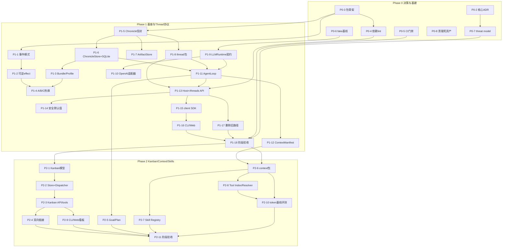

# Bee Agent v1.0.0 重构开发计划

> 状态：Active
> 上游文档：[bee-agent-v1.0.0-architecture-upgrade.md](./bee-agent-v1.0.0-architecture-upgrade.md)（下称"方案"）
> 当前实施分支：`feature/kernel-opt`
> 基线：Bee Agent v0.11.0（commit `1eb2a1a`）
> 日期：2026-08-24
> 排期约定：本计划不含日历排期；任务只标注依赖关系与相对规模（S/M/L），S 为单次专注会话可完成，M 为数个工作日，L 为需要多次会话且应再拆分

> 2026-08-25 内核实施覆盖：本文件 Phase 1 中关于最小 Context、EffectScope、PluginHandle 和 ReplacementCoordinator 的完成描述已由 ADR 0030 取代。当前实现是 Cordis 派生 Context–Registry–Fiber + Bee StructureGeneration；旧近似层已删除。内核的现行开发规则以 `kernel-opt-development-plan.md` 为准。

> 2026-08-25 结构协调覆盖：ADR 0032 已完成 EffectiveStructure 驱动、插件工厂注册表、Chronicle 生命周期事实、失败候选回滚、C-tier restart-required 与 Host 重启重建。

> 2026-08-26 Phase 3 完成：ADR 0023/0033/0034、权限交集快照、ExecutionWorld、Seatbelt/bwrap CI、Keychain/Secret Service、Command/Python/MCP、worktree、bounded delegation 与 RemoteAgent v2 已落地；Phase 4 可按 §5.5 启动。

> 2026-08-27 Phase 4 启动（分支 `feature/v1.4.0`）：WF4-A MemoryProvider 契约与契约套件、WF4-B 核心（内嵌 memory-bee 提供者 + retrieve hook 召回 + 近线派生 worker + 记忆治理路由 + Goal/Plan hook 接线 + `BEE_AGENT_STRUCTURE_FILE` 热重载）、WF4-C（memory-remote 断路器/显式降级/health 事件 + HTTP transport 与线契约）、§7.2 P4 CI 门禁（矛盾/时间有效性/outage 降级/fake clock 跨天召回）、WF4-D（WorldModel 版本化投影 + StructureGraph lineage + 环境 projector + Host 实时投影 + `GET /world`）、WF4-E（Trajectory 因果视图 + 模型上下文精确重放路由）与 WF4-F（AgentScheduler 持久化时间/条件触发 + catch-up + `/scheduler` 路由）已完成；统一个人数据目录（`BEE_AGENT_DATA_DIR`/平台约定）已落地。剩余：MCP 记忆 transport、checkpoint fork、守护形态与验收 ADR 0021/0024/0027。

## 1. 计划定位与使用方式

### 1.1 与架构方案的关系

方案回答"做什么、为什么"；本计划回答"怎么做、按什么顺序、何时算完成"。两份文档的对应关系：

- 方案 §18（模块与目录调整）→ 本计划 §3（迁移映射）与 §5（各阶段任务）；
- 方案 §19（实施路线 Phase 0–6）→ 本计划 §5 采用**相同阶段编号**，并细化为可执行任务/工作流；
- 方案 §20（发布验收标准）→ 本计划 §7（验收与质量门禁）；
- 方案 §22（建议新增 ADR）→ 本计划 §5.8（ADR 分配总表）。

冲突裁决规则：若本计划与方案出现冲突，以方案为准并立即修订本计划；若实施中发现两者都不再成立，先改方案（或补充 ADR），再同步本计划。

### 1.2 分支与版本策略（原计划与现行覆盖）

- 原计划为每个 Phase 建立一个小版本分支；Phase 1–3 实际收敛到 `feature/kernel-opt` 连续提交以避免跨分支保留半迁移架构。自 Phase 4 起恢复版本分支（`feature/v1.4.0`），以本文件状态列、ADR 和提交历史为事实；
- 每个可验证切片独立提交；最终发布版本号在 Phase 6 验收时确定；
- v0.11.0 在基线 commit 上冻结为 legacy tag（任务 P0-1）；`main` 进入维护模式，只接收 v0 的关键缺陷修复，不接收新功能，降低合并压力；
- clean break：各阶段**末尾**删除旧路径（旧 API、旧运行时、旧事件类型），不保留兼容 facade；删除动作是阶段退出条件的一部分，不允许"新旧并存渡过下个阶段"；
- changesets 纪律延续（ADR 0008）：每个包级变更附 `.changeset/*.md`；发布时统一消费积压的 changeset。

### 1.3 计划维护规则

- Phase 0–2 的任务表带**状态列**（`todo / doing / done / skipped`），随实施直接更新本文件；
- 每个阶段完成时：对照 §7.1 退出条件逐项核验，并将下一阶段的工作流细化成任务级条目（远期粗 → 近期细的滚动细化）；
- 任务被跳过或范围变化时必须在表内注明原因，不允许静默删行；
- 每个新模块动工前过一次准入检查（方案 Phase 0 退出条件）："它是否让 Bee 更简单、更聪明或更安全"——不能回答的不开工。

## 2. 基线盘点

以下事实来自对基线 commit 的源码审计，是本计划迁移映射与任务拆分的直接依据。

### 2.1 现有资产清单

| 模块                                | 规模（src LOC） | 内容摘要                                                                                                                                             | v1 去向（见 §3.2）                                                                      |
| ----------------------------------- | --------------- | ---------------------------------------------------------------------------------------------------------------------------------------------------- | --------------------------------------------------------------------------------------- |
| `packages/contracts`                | 214             | 全部 Zod 契约：Task/事件/工具/审批/记忆 DTO；其中 `CheckpointSchema`、`HandoffSchema` 为死契约（全仓库零引用）                                       | 按域拆入 thread / knowledge / execution，包删除                                         |
| `packages/event-store`              | 10              | 仅 `EventStore` 接口；无 expected-sequence、无跨流语义                                                                                               | 并入 knowledge 的 ChronicleStore 契约                                                   |
| `packages/storage`                  | 197             | `StorageProvider`/事务管理器/方言抽象 + EventStore contract suite（`testing.ts`）                                                                    | 演进为 storage（持久化原语 + 契约套件模式）                                             |
| `packages/vector-store`             | 330             | `VectorStore` 接口 + contract suite                                                                                                                  | 吸收进 memory-bee 内部与测试模式，包删除                                                |
| `packages/plugin-sdk`               | 21              | `PluginManifestSchema` + `BeeAgentPlugin`；capabilities/permissions 仅声明、内核不强制                                                               | 并入 kernel（新 manifest/capability/permission 契约）                                   |
| `packages/kernel`                   | 952             | cordis ^3.18.1 封装：Kernel 生命周期、service slot、task scope、插件挂载；EventBus **只有 serial/waterfall 两种模式**                                | 原位演进（事件模式补全、可逆 effect 正式化、bundle/profile）                            |
| `packages/runtime`                  | 1698            | TaskRuntime（627 行编排器）、任务状态机、12 种事件 payload、Tool/ToolRegistry、PolicyEngine、Agent 接口、MockAgent、MemoryRuntime、chunker、Embedder | 拆分重写：TaskRuntime/MemoryRuntime 删除，其余按域归入 runtime/context/execution/kanban |
| `packages/model-providers`          | 441             | `OpenAIChatAgent`（内含 messages 数组 + 工具循环）、`OpenAIEmbedder`                                                                                 | 重写为 adapters/models/*（LLMRuntime 适配器，去 loop）                                  |
| `packages/client`                   | 387             | REST + SSE SDK（`/tasks` 全套 + SSE 解析器）                                                                                                         | 重写为面向 `/threads` + Item stream                                                     |
| `apps/server`                       | 822             | Fastify 组合根；13 个端点；无认证，CORS 默认反射任意来源                                                                                             | 重写为 `apps/bee`（Personal Bee Host）                                                  |
| `apps/cli`                          | 533             | HTTP-only CLI（task/approval/memory 命令组）                                                                                                         | 重写（对话 + Kanban 命令）                                                              |
| `apps/web`                          | 146             | React 19 任务控制台（单视图，7 个 SDK 调用）                                                                                                         | 重写（Thread/Kanban/审批视图）                                                          |
| `plugins/storage/sqlite`            | 249             | better-sqlite3 + WAL + 事务序列分配                                                                                                                  | 演进为 `adapters/storage/sqlite`（默认嵌入式存储）                                      |
| `plugins/storage/postgres`          | 280             | pg Pool + 原子序列分配                                                                                                                               | 演进为 `adapters/storage/postgres`（可选后端）                                          |
| `plugins/vector/pgvector`           | 315             | pgvector + embedding space 注册表                                                                                                                    | 删除（语义检索由 memory-bee 内嵌向量与 memory-remote 承接）                             |
| `plugins/tools/calculator`          | 268             | 安全表达式求值工具（默认挂载）                                                                                                                       | 迁移为 `adapters/tools/calculator`                                                      |
| `plugins/tools/python`              | 205             | one-shot `spawn(python3)`，stdin JSON 协议                                                                                                           | 迁移入统一执行管线                                                                      |
| `plugins/tools/mcp`                 | 402             | 零依赖 MCP stdio 客户端（自带 spawn）                                                                                                                | 迁移入统一执行管线                                                                      |
| `adapters/agents`                   | 202             | `RemoteAgent`（未接线）、`CommandAgent`（直接 `spawn`）                                                                                              | 经 AgentProtocol 重写为 adapters/agents/{local,remote,command}                          |
| `migrations/`                       | —               | 与插件内嵌 DDL 重复，postgres 侧为空                                                                                                                 | 收编进 storage 统一迁移机制                                                             |
| `configs/*.yaml`                    | —               | 死配置（无任何代码加载）                                                                                                                             | 删除                                                                                    |
| `tests/{contracts,e2e,integration}` | —               | 仅占位 README                                                                                                                                        | Phase 0 决策处置（§5.1 P0-9）                                                           |
| `python/`                           | —               | 占位 README                                                                                                                                          | 保留占位，Phase 3 后按需启用                                                            |
| `.changeset/`                       | —               | 已配置，11 个待消费 changeset                                                                                                                        | 延续使用                                                                                |

### 2.2 重构必须解决的结构性问题（源码审计确认）

1. **内核层**：EventBus 缺 `emit`（广播）与 `parallel`（并发）模式；插件 capabilities/permissions 无运行时强制；无 bundle/profile 解析，无 EffectiveStructure 版本化。
2. **事件层**：`EventStore` 以 taskId 为唯一流，无 expected-sequence 并发控制 API，无 schema registry（未知事件在 `applyTaskEvent` 中被静默跳过），无 classification/retention，大 payload 直接进事件表。
3. **运行时层**：`OpenAIChatAgent.run()` 内部维护临时 messages 并自跑工具循环——模型可见内容无法从持久化事件精确重建；TaskRuntime 是一次性状态机，无法表达长期目标与后台任务。
4. **审批层**：审批等待是进程内 Promise Map（`#pendingByRequest`），重启后 `waiting_approval` 任务永久悬挂；单任务同时只允许一个待审批。
5. **执行层**：`command-agent.ts`、`mcp-client.ts`、`python-tool.ts` 三处各自手写 spawn，各自重复 env 合并/超时/stderr 截断逻辑，且 `env: {...process.env, ...}` 继承宿主全部环境变量。
6. **服务边界**：无认证、CORS 宽松、RemoteAgent 未接线、CI 不启动 PostgreSQL（postgres/pgvector/memory 测试在 CI 静默跳过）、`vitest.workspace.ts` 漏配 `adapters/*`。

## 3. 目标包结构与迁移映射

### 3.1 目标工作区布局

```
packages/
  kernel/      Cordis-style Context、service slots、inject、事件四模式、
               可逆 effect、bundle/唯一 bee Profile、插件 manifest 契约
  thread/      Thread–Turn–Item 协议、Item 生命周期事件、客户端契约（leaf 级协议类型）
  kanban/      KanbanTask、状态机、store 契约、claim/lease、Dispatcher
  runtime/     AgentLoop、Goal/Plan/Episode/Step、调度、checkpoint、trajectory 视图
  context/     Prompt sections、ContextBudget、压缩、Skill Registry、Tool Index/Resolver
  knowledge/   Chronicle、ChronicleStore 契约、World/Structure、MemoryProvider 契约、
               Claim/Representation
  execution/   Capability、Permission、Approval（持久化）、SecretBroker、
               ExecutionWorld 契约、Sandbox 契约、ArtifactStore 契约
  learning/    Deriver、Consolidator、Skill learning、Proposal、Experiment、Eval
  storage/     嵌入式存储原语、方言契约、事务、迁移/导出框架、contract suite 模式
adapters/
  models/      openai-chat 等 LLMRuntime 适配器
  storage/     sqlite（默认）、postgres
  sandbox/     seatbelt、bwrap、oci、remote、fake
  tools/       calculator、command、python、mcp
  agents/      local、remote、command（AgentProtocol 实现）
plugins/
  memory-bee/    默认内嵌记忆实现（SQLite/FTS + 可选本地向量）
  memory-remote/ 唯一外部记忆入口（HTTP/MCP/SDK bridge）
apps/
  bee/    Personal Bee Host（单进程默认形态）
  web/    本地 UI
  cli/    连接 Host 的命令行
workers/
  sandbox/   按需子进程/容器（Phase 3）
  learner/   默认在 Host 内，可选独立进程（Phase 5）
```

### 3.2 迁移映射表

处置分四类：**演进**（保留代码原地深化）、**拆分**（按域并入多个目标包）、**迁移**（换目录并接入新契约）、**删除**（clean break，不留 facade）。

| 现有模块                            | 处置             | 目标位置与说明                                                                                                                                                                                                                                                                                                                                                                                                                  |
| ----------------------------------- | ---------------- | ------------------------------------------------------------------------------------------------------------------------------------------------------------------------------------------------------------------------------------------------------------------------------------------------------------------------------------------------------------------------------------------------------------------------------- |
| `packages/kernel`                   | 演进             | 原地深化：事件模式补全（P1-1）、可逆 effect/drain（P1-2）、bundle/profile（P1-3）、A/B/C 热换（P1-4）；吸收 plugin-sdk 的 manifest 契约并赋予运行时强制力                                                                                                                                                                                                                                                                       |
| `packages/contracts`                | 拆分             | Thread/Turn/Item/流式协议 → thread；ChronicleEvent 信封与事件类型 → knowledge；Tool/Capability/Approval/Secret 契约 → execution；Memory DTO → knowledge（MemoryProvider 契约）；包本身删除                                                                                                                                                                                                                                      |
| `packages/event-store`              | 拆分             | 接口并入 knowledge（ChronicleStore）；`MemoryEventStore` 测试夹具随 contract suite 迁移                                                                                                                                                                                                                                                                                                                                         |
| `packages/storage`                  | 演进             | 保留事务/方言抽象；`defineEventStoreContractSuite` 模式泛化为多契约套件工厂                                                                                                                                                                                                                                                                                                                                                     |
| `packages/vector-store`             | 删除（部分吸收） | 接口与 FTS/向量细节归 memory-bee 内部；contract suite 模式迁入 storage 供 MemoryProvider 套件复用                                                                                                                                                                                                                                                                                                                               |
| `packages/plugin-sdk`               | 拆分             | manifest schema 并入 kernel；`BeeAgentPlugin` 生命周期并入 kernel 插件系统                                                                                                                                                                                                                                                                                                                                                      |
| `packages/runtime`                  | 拆分             | `agent.ts` 的 Agent 语义 → runtime（AgentLoop）+ adapters/models（LLMRuntime）；`tool.ts`/`policy.ts` → context（注册/索引）+ execution（权限/执行）；`task-state-machine`/`task-events`/`task-runtime` → 删除，由 thread + kanban + runtime 的新状态机取代；`memory-runtime`/`memory-chunker` → 删除（memory-bee 取代）；`mock-agent` → 删除（fake LLMRuntime 取代，入测试基线）；`embedder.ts` → memory-bee / adapters/models |
| `packages/model-providers`          | 迁移             | → `adapters/models/`；`OpenAIChatAgent` 重写为实现 LLMRuntime 契约的纯适配器（无内部循环、无 messages 状态）；`OpenAIEmbedder` 随 memory 走                                                                                                                                                                                                                                                                                     |
| `packages/client`                   | 迁移             | → 原地重写为 `/threads` + Item stream SDK；SSE 解析器（`parseSseStream`）保留复用                                                                                                                                                                                                                                                                                                                                               |
| `apps/server`                       | 迁移             | → `apps/bee`；Fastify 骨架、错误包装、SSE 传输经验保留，端点按新协议重写                                                                                                                                                                                                                                                                                                                                                        |
| `apps/cli` / `apps/web`             | 迁移             | 原地重写；CLI 命令树换为 thread/kanban/approval；Web 换 Item 流消费                                                                                                                                                                                                                                                                                                                                                             |
| `plugins/storage/sqlite`            | 迁移             | → `adapters/storage/sqlite`，升级为默认嵌入式存储（新增 Chronicle/Kanban/审批/记忆表族）                                                                                                                                                                                                                                                                                                                                        |
| `plugins/storage/postgres`          | 迁移             | → `adapters/storage/postgres`（多设备/远程 Worker 场景的可选后端）                                                                                                                                                                                                                                                                                                                                                              |
| `plugins/vector/pgvector`           | 删除             | —                                                                                                                                                                                                                                                                                                                                                                                                                               |
| `plugins/tools/calculator`          | 迁移             | → `adapters/tools/calculator`（经 ExecutionWorld）                                                                                                                                                                                                                                                                                                                                                                              |
| `plugins/tools/python`              | 迁移             | → `adapters/tools/python`（经 ExecutionWorld，Phase 3 完成迁入）                                                                                                                                                                                                                                                                                                                                                                |
| `plugins/tools/mcp`                 | 迁移             | → `adapters/tools/mcp`（经 ExecutionWorld，Phase 3 完成迁入）                                                                                                                                                                                                                                                                                                                                                                   |
| `adapters/agents`                   | 迁移             | → `adapters/agents/{local,remote,command}`，统一实现 AgentProtocol（Phase 3）                                                                                                                                                                                                                                                                                                                                                   |
| `migrations/`                       | 拆分             | DDL 收编进 adapters/storage 各自的版本化迁移；目录并入 storage 迁移框架                                                                                                                                                                                                                                                                                                                                                         |
| `configs/`                          | 删除             | 死配置                                                                                                                                                                                                                                                                                                                                                                                                                          |
| `tests/{contracts,e2e,integration}` | 演进             | 启用为跨包契约/e2e/集测试层（P0-9）                                                                                                                                                                                                                                                                                                                                                                                             |

### 3.3 包间依赖规则

允许的依赖方向（箭头 = 允许 import）：

```
kernel            （无内部依赖；仅 cordis/zod）
storage           （无内部依赖；持久化原语）
knowledge         → kernel, storage
thread            → kernel, knowledge        （协议类型保持 leaf：不引 cordis 运行时，供 client 复用）
kanban            → kernel, knowledge
execution         → kernel, knowledge
context           → kernel, thread, knowledge, execution
runtime           → kernel, thread, kanban, context, knowledge, execution
learning          → kernel, knowledge, runtime, context
adapters/*        → 其实现的契约所在包（如 adapters/storage/sqlite → knowledge, kanban, storage）
plugins/memory-*  → kernel, knowledge, storage
apps/*            → 全部（组合根）
packages/client   → thread（仅协议类型）
```

硬性规则：禁止反向依赖与循环依赖；`kernel` 与 `storage` 不得 import 任何其他内部包；除 apps 外任何包不得 import `apps/*`。由 eslint import 边界规则静态强制（任务 P0-4）。

## 4. 贯穿性工程基建

以下基建在 Phase 0 建立、随阶段递进，不属于任何单一阶段：

1. **CI 门禁递进**（详见 §7.2）：Phase 0 起引入 PostgreSQL + pgvector service；后续每阶段把该阶段的核心契约套件与故障注入测试加入 CI，杜绝"测试静默跳过"。
2. **确定性测试基线**：fake clock（可注入、可跳时）、fake LLMRuntime（脚本化决策流）、fake tool/sandbox/memory provider；所有涉及时间、模型与随机的测试必须使用注入实现，保证 golden replay 可复现。
3. **contract suite 模式**：沿用 `defineEventStoreContractSuite` 的"接口包定义套件、实现包消费套件"模式，扩展出 ChronicleStore、KanbanStore、MemoryProvider、SandboxProvider、ExecutionWorld 五套契约套件；每套套件是相应适配器的合入门槛。
4. **静态边界规则**：eslint 强制（a）§3.3 包依赖图；（b）Phase 3 起全仓库禁 `child_process.spawn` 直接调用（白名单仅 `execution` 包与 `workers/sandbox`）；（c）禁止子进程继承完整 `process.env`。
5. **schema registry**：Chronicle 事件类型注册中心（P1-5），未知类型默认失败、显式 ignorable 才跳过；工具/Skill/插件 ID 命名空间与冲突即失败（P2-9）。

## 5. 阶段计划

### 5.0 阶段总览

| 阶段    | 主题                           | 关键交付                                                                              | 方案对应    | 分配 ADR         |
| ------- | ------------------------------ | ------------------------------------------------------------------------------------- | ----------- | ---------------- |
| Phase 0 | 决策与基建                     | legacy tag、核心 ADR、包骨架、CI 门禁、测试基线、threat model                         | §19 Phase 0 | 0017, 0018, 0031 |
| Phase 1 | Cordis 基座与 Thread 协议      | 内核深化、Chronicle、thread 包、AgentLoop、/threads API、client/CLI/Web、删除旧运行时 | §19 Phase 1 | 0019, 0020, 0028 |
| Phase 2 | Kanban、Context Budget、Skills | kanban 包与 Dispatcher、上下文预算与压缩、Skill/Tool 两阶段加载、Goal/Plan 可选增强   | §19 Phase 2 | 0022, 0029       |
| Phase 3 | 统一执行世界与安全边界         | ExecutionWorld、权限/审批持久化、SecretBroker、沙箱 provider、worktree、工具全量迁入  | §19 Phase 3 | 0023, 0030       |
| Phase 4 | 记忆、世界与长时运行           | memory-bee、memory-remote、World/Structure、Trajectory、Scheduler、Host 守护运行      | §19 Phase 4 | 0021, 0024, 0027 |
| Phase 5 | 后台学习                       | Consolidator、Proposal、Experiment、L0–L3 自治分级、回滚保护                          | §19 Phase 5 | 0025, 0026       |
| Phase 6 | 体验收敛与发布                 | onboarding、doctor、v0 导入、文档、发布验收                                           | §19 Phase 6 | —                |

### 5.1 Phase 0：决策与基建（任务级）

| ID   | 任务                    | 内容                                                                                                                                                             | 依赖 | 规模 | 验收标准                                                          | 状态                                                                                                                                                                 |
| ---- | ----------------------- | ---------------------------------------------------------------------------------------------------------------------------------------------------------------- | ---- | ---- | ----------------------------------------------------------------- | -------------------------------------------------------------------------------------------------------------------------------------------------------------------- |
| P0-1 | 冻结 v0 legacy          | 在 `1eb2a1a` 上打 `v0.11.0-legacy` tag；README/README-ZH 标注 v0 维护模式                                                                                        | —    | S    | tag 存在；双 README 同步更新                                      | done                                                                                                                                                                 |
| P0-2 | 核心 ADR                | 撰写 ADR 0017（个人超级智能体定位）、0018（Cordis-style 可逆插件微内核）、0031（v1 clean break），沿用现有 7 节模板                                              | —    | S    | 三份 ADR 合入，模板与既有 16 份一致                               | done                                                                                                                                                                 |
| P0-3 | 新包骨架                | 创建 §3.1 的 9 个目标包目录 + package.json/tsconfig/空 src/index.ts，挂入 pnpm workspace 与 vitest workspace                                                     | —    | M    | `pnpm build/typecheck/test` 全绿；workspace 含 adapters/*         | done                                                                                                                                                                 |
| P0-4 | 依赖边界 lint           | eslint 规则强制 §3.3 依赖图；旧包暂按现有实际依赖跑通，新包立即生效                                                                                              | P0-3 | M    | 违规 import 在 CI 失败；规则有单测                                | done                                                                                                                                                                 |
| P0-5 | CI 门禁改造             | ci.yml 增加 postgres+pgvector service；postgres/pgvector/memory 旧套件在 CI 真实执行；统一"跳过需显式环境标注"策略；修复 vitest.workspace.ts 漏配 adapters/\*    | —    | M    | CI 日志可见 postgres 套件执行而非 skip；无隐性跳过                | done（CI run 32732838663 确认 postgres 9/pgvector 12 用例执行通过；触发条件已扩展到 feature/v\* 分支推送）                                                           |
| P0-6 | 确定性测试基线          | fake clock / fake LLMRuntime / fake tool 放入 kernel 测试工具模块；选一既有测试改造示范                                                                          | P0-3 | M    | 基线可用并被示范测试引用；文档说明注入约定                        | done（示范以基线自身 9 项单测承担，旧运行时不补新测试）                                                                                                              |
| P0-7 | threat model 与数据目录 | 撰写 threat model 文档（资产/攻击面/信任边界，覆盖方案 §13.5/§16.4）；设计个人数据目录布局与 export/import 边界（设计文档，不实现）                              | P0-2 | M    | 文档合入 docs/architecture/；数据目录布局被 ADR 0018 或 0027 引用 | done（ADR 0017/0018 已引用）                                                                                                                                         |
| P0-8 | 清理死资产              | 删除 configs/*.yaml、contracts 死契约、migrations/ 重复 DDL；决策 tests/ 占位目录的去留（建议：contracts 并入各契约套件、e2e/integration 保留待 Phase 1/2 启用） | —    | S    | 死代码清零；决策记录进本表备注                                    | done（决策：tests/contracts 删除并入各包契约套件；e2e/integration 保留待 Phase 1/2 启用；DDL 归属插件内嵌迁移，Phase 1 起收编进 storage 框架）                       |
| P0-9 | 阶段验收                | 对照 §7.1 Phase 0 退出条件；细化 Phase 1 任务状态                                                                                                                | 全部 | S    | 退出条件逐项核验通过                                              | done（build/typecheck/lint/boundaries/test/format 全绿；额外修复既有 adapters↔server 循环依赖：联邦测试移至 apps/server/tests/federation.test.ts 并删除反向 devDep） |

### 5.2 Phase 1：Cordis 基座与 Thread 协议（任务级）

任务按四条轨道组织：内核（K）、事件（C）、协议与循环（T）、宿主与客户端（H）。依赖图见 §6。

| ID    | 轨道 | 任务                      | 内容                                                                                                                                                                                                                                      | 依赖             | 规模 | 验收标准                                                    | 状态                                                                                                                                                                                                                                                             |
| ----- | ---- | ------------------------- | ----------------------------------------------------------------------------------------------------------------------------------------------------------------------------------------------------------------------------------------- | ---------------- | ---- | ----------------------------------------------------------- | ---------------------------------------------------------------------------------------------------------------------------------------------------------------------------------------------------------------------------------------------------------------- |
| P1-1  | K    | 事件模式补全              | EventBus 增加 `emit`（广播、错误隔离）与 `parallel`（并发、AggregateError）模式，与既有 serial/waterfall 并存；四模式契约测试                                                                                                             | —                | M    | 四模式行为有单测；现有 kernel 测试不回归                    | done（emit/parallel 落地，8 项新单测，共用监听器注册表、调用点选语义）                                                                                                                                                                                           |
| P1-2  | K    | 可逆 effect 正式化        | 统一 disposer 注册与逆序释放；插件增加 drain/quiesce + 健康检查接口；卸载失败进入 quarantine 并标记 restart-required，不得强行覆盖                                                                                                        | P1-1             | L    | 生命周期故障注入测试通过（含卸载抛错场景）                  | done（EffectScope 逆序释放；TaskScope/Kernel.stop 均逆序；drain/healthCheck 为可选 hooks；quarantine 记录在 kernel 且禁止同 id 重挂）                                                                                                                            |
| P1-3  | K    | Bundle 与唯一 bee Profile | bundle 定义语法、组合解析为 EffectiveStructure、digest 计算、解析结果写入 Chronicle；不提供 Profile 创建/切换                                                                                                                             | P1-6             | L    | 同一 bundle 两次解析 digest 一致；effective tree 可查询来源 | done（Bundle 分层组合：includes 先折叠、includer 胜出；digest 为 canonical JSON 的 sha256；knowledge 侧 structure.resolved 事件写入 Chronicle 且 digest 未变不新增版本）                                                                                         |
| P1-4  | K    | A/B/C 分级热换            | 插件声明替换级别；B 级在 Turn 边界重绑（停新调用→drain→checkpoint→重绑）；Turn 执行期间固定 StructureVersion                                                                                                                              | P1-2, P1-3       | L    | A/B/C 三级各有边界测试；执行中替换不影响当前 Turn           | done（ReplacementTier a/b/c + ReplacementCoordinator：A 级无调用占用直换、B 级 Turn 边界 drain→重绑、C 级 restart-required；beginTurn 固定 StructureVersion，替换不影响当前 Turn）                                                                               |
| P1-5  | C    | Chronicle 信封与 registry | 方案 §8.2 事件信封全集（时间字段、causation/correlation、classification/retention）；`(streamId, sequence)` 唯一；append 带 expected sequence；schema registry：未知 eventType 默认失败、显式 ignorable 才跳过；大 payload 走内容寻址引用 | —                | L    | 信封 Zod 契约 + registry 单测；并发 append 冲突返回明确错误 | done（含 idempotent append 重试语义与 ignorable 显式跳过）                                                                                                                                                                                                       |
| P1-6  | C    | ChronicleStore + SQLite   | ChronicleStore 契约与 contract suite（自 `defineEventStoreContractSuite` 演进：多流、expected sequence、跨流查询）；`adapters/storage/sqlite` 实现并成为默认                                                                              | P1-5, P0-3       | L    | contract suite 通过；replay 重放一致                        | done（SQLite 实现先落在 plugins/storage/sqlite 内演进，P1-17 时随包迁往 adapters/storage/sqlite）                                                                                                                                                                |
| P1-7  | C    | ArtifactStore             | 内容寻址存储契约 + 本地实现；事件只存 digest 引用                                                                                                                                                                                         | P1-5             | M    | 大 payload 往返一致；引用缺失时显式报错                     | done（execution 包契约 + LocalArtifactStore，sha256 分桶 + 原子写 + 去重）                                                                                                                                                                                       |
| P1-8  | T    | thread 包                 | Thread/Turn/Item 模型与 Zod 契约；Item 生命周期事件（started/delta/completed/failed）；流式分页与 `after` 恢复语义；协议类型零 cordis 依赖                                                                                                | P1-5             | L    | 协议契约测试；client 可仅依赖协议类型                       | done（/protocol 子路径零 cordis 仅依赖 zod；wire 事件与 Chronicle 事件一一对应，sequence 即流位置；readThreadEvents 提供 after 恢复 + limit 分页）                                                                                                               |
| P1-9  | T    | LLMRuntime 契约           | 输入 ContextBundle、输出 message delta/结构化决策流、usage 统计、取消与重试分类；Provider 不持有 messages 状态                                                                                                                            | —                | M    | 契约类型评审通过；fake LLMRuntime 实现入库                  | done（契约纯 TS 零依赖落在 runtime/llm-runtime；@bee-agent/runtime/testing 提供 createFakeLlmRuntime，kernel/testing 的 createScriptedModel 待 P1-11 迁移后移除）                                                                                                |
| P1-10 | T    | OpenAI 适配器重写         | `adapters/models/openai-chat` 实现新 LLMRuntime；删除内部工具循环与 messages 数组                                                                                                                                                         | P1-9             | M    | 既有 model-providers 测试改写后通过；无内部循环             | done（OpenAIChatRuntime 实现 LlmRuntime：无内部循环、无 messages 状态；工具意图作为 tool-intent 流出；provider 错误分类 retryable/fatal/context-overflow；旧 OpenAIChatAgent 删除）                                                                              |
| P1-11 | T    | AgentLoop                 | Step 循环（Observe→Retrieve→Plan→Act→Verify→Record 的最小核：Act/Record 先行，检索/计划钩子留接口）；工具调度经执行插槽（本阶段直连，Phase 3 换 ExecutionWorld）；审批等待挂起；checkpoint；terminal decision                             | P1-6, P1-8, P1-9 | L    | 崩溃后可从 Chronicle + checkpoint 续跑（测试覆盖）          | done（Act/Record 最小核：步循环 + 工具经执行插槽直连 + 审批挂起/恢复 + checkpoint 每步落 Chronicle；recoverTurn 从 Chronicle + 最后 checkpoint 续跑；retrieve/plan 留 Phase 2 钩子）                                                                             |
| P1-12 | T    | ContextManifest 最小版    | 每次模型调用持久化 manifest（sections/digest/tokens/omissions 结构落地）；预算分配留待 Phase 2                                                                                                                                            | P1-5, P1-11      | M    | 任意历史调用可由 source+renderer 重建输入                   | done（context 包提供 manifest/digest；2026-08-25 内核增强由插件化 ModelRequestService 统一落 `context.manifest + model.requested + terminal event`，source snapshot + renderer 与完整 bundle 双摘要重建验证）                                                    |
| P1-13 | H    | Host 雏形 + /threads API  | `apps/bee`：`POST /threads`、`POST /threads/:id/turns`、`GET .../items`（SSE 流 + Last-Event-ID 恢复）；审批走持久化 Item 的最小实现                                                                                                      | P1-8, P1-11      | L    | 一个命令启动；SSE 断线重连不丢 Item                         | done（apps/bee：POST /threads、POST /threads/:id/turns、POST .../approvals/:approvalId、GET /threads/:id/items SSE + Last-Event-ID 恢复；BroadcastingChronicleStore 装饰器实时推送；一个命令启动）                                                               |
| P1-14 | H    | 安全默认值先行            | 默认仅监听 loopback；本地一次性会话 token；CORS 收紧为自身 origin（方案 §16.4 中可先行部分）                                                                                                                                              | P1-13            | S    | 远程默认不可达；CORS 不再反射任意 origin                    | done（CORS 默认 loopback-only 不再反射任意 origin（含 SSE 劫持路径）；非 loopback 监听无 token 时 fail closed；一次性会话 token 每次启动生成并校验，/health 豁免）                                                                                               |
| P1-15 | H    | client SDK 重写           | 面向 /threads + Item stream；复用 `parseSseStream`                                                                                                                                                                                        | P1-13            | M    | SDK 契约测试（含 SSE 恢复）通过                             | done（client 面向 /threads：createThread/createTurn/resolveApproval/streamItems；仅依赖 thread/protocol 零依赖面；parseSseStream 复用）                                                                                                                          |
| P1-16 | H    | CLI 与 Web 重写           | CLI 对话命令（thread/turn/approval）；Web 消费 Item 流的对话视图                                                                                                                                                                          | P1-15            | M    | CLI 可完成连续对话 + 工具调用 + 审批；Web 同步验收          | done（CLI：bee chat 连续对话 + 审批 + bee thread create；Web：对话视图消费 Item 流 + 内联审批）                                                                                                                                                                  |
| P1-17 | H    | 删除旧路径                | 删除 TaskRuntime、task-events、task-state-machine、旧 `/tasks` API、旧 client 方法、MockAgent、MemoryRuntime（含 PG/pgvector 插件下线）；旧测试随删                                                                                       | P1-13 验收后     | M    | 仓库内无旧运行时残留引用；build/test/lint 全绿              | done（删 apps/server、contracts、event-store、vector-store、plugin-sdk、plugins/{storage/postgres,vector/pgvector,tools/*}、adapters/agents；runtime 删 v0 组件仅留 AgentLoop/LLMRuntime；sqlite chronicle 迁 adapters/storage/sqlite；scanner 收敛为纯 v1 DAG） |
| P1-18 | —    | 阶段验收                  | 对照 §7.1 Phase 1 退出条件；撰写 ADR 0019/0020/0028；细化 Phase 2                                                                                                                                                                         | 全部             | S    | 退出条件逐项核验；ADR 合入                                  | done（§7.1 核验：一个命令启动 Host✓ / 连续对话+暂停+恢复+查看 Item✓ / 替换模型插件不改 AgentLoop✓ / 旧运行时路径已删✓；CI 门禁 Chronicle suite + replay + SSE 恢复 + 生命周期故障注入全绿；ADR 0019/0020/0028 合入）                                             |

### 5.3 Phase 2：Kanban、Context Budget、Skills（任务级）

| ID    | 任务                      | 内容                                                                                                                                                                                                                                              | 依赖       | 规模 | 验收标准                                                        | 状态                                                                                                                                                    |
| ----- | ------------------------- | ------------------------------------------------------------------------------------------------------------------------------------------------------------------------------------------------------------------------------------------------- | ---------- | ---- | --------------------------------------------------------------- | ------------------------------------------------------------------------------------------------------------------------------------------------------- |
| P2-1  | Kanban 领域模型           | KanbanTask 字段全集（方案 §15.2：目标/验收/依赖/来源/workspace/capability/预算/scheduledAt/deadline/idempotency key/认领租约）；状态机 `inbox→triaged→ready→running→blocked/review→done` + `failed/cancelled/archived`；expected-version 并发控制 | P1-6       | L    | 状态机单测全覆盖；并发转换冲突报错                              | done（KanbanTask 全字段 + 状态机 + expected-version + Chronicle 事件；25 单测，含转移表全覆盖与并发冲突）                                               |
| P2-2  | KanbanStore + Dispatcher  | store 契约 + SQLite 实现 + contract suite；Dispatcher：claim/lease/heartbeat、超时回收、依赖/时间/优先级调度、幂等重试、backpressure；Host 重启恢复                                                                                               | P2-1       | L    | 故障注入测试（杀 Worker/租约过期/重复认领）通过；任务跨重启续跑 | done（KanbanStore 契约 + ChronicleKanbanStore + Dispatcher + contract suite + SQLiteKanbanStore；含杀 Worker/租约过期/重复认领/跨重启）                 |
| P2-3  | Kanban API 与 agent tools | REST 端点 + `kanban_create/list/show/update/block/comment/complete/cancel` 工具（延迟加载形态）；CLI/Web/Scheduler/Agent 读写同一 store                                                                                                           | P2-2       | M    | 对话内创建的任务可由后台认领并跨重启完成                        | done（/kanban/tasks REST + 8 个 kanban_* 延迟加载工具 + client/CLI 同 store；集成测试：对话工具建任务→后台 dispatcher 认领完成→跨重启恢复）             |
| P2-4  | Kanban↔Thread 双向链接    | 来源 Thread/Turn 与执行 Episode、Artifact、最终 Item 双向可追溯                                                                                                                                                                                   | P2-3       | M    | 任一方向查询不超过一步跳转                                      | done（KanbanSource 加 itemId + list 加 sourceThreadId/sourceItemId；工具 context 记录来源；双向均一步跳转）                                             |
| P2-5  | Goal/Plan 可选增强        | Thread 层 Goal/Plan 版本化 DAG；复杂任务自动出现、简单问答零仪式                                                                                                                                                                                  | P1-11      | M/L  | 简单对话不产生 Goal/Plan 噪声；复杂任务有可查 Plan              | done（Goal/Plan 版本化 DAG + MemoryGoalPlanStore + 复杂度门控 plan hook；简单问答零输出，复杂任务生成可查 Plan）                                        |
| P2-6  | context 包                | PromptSection 渲染器与 rendererVersion；ContextBudget 按方案 §10.4 优先级分配；压缩策略与"不可删清单"（未决审批/未消费工具结果/活跃计划约束/失败原因/artifact 引用/记忆来源/权限边界）；ContextManifest 完整版（含 omissions 审计）               | P1-12      | L    | 压缩后关键信息保留性有测试；manifest 可解释 token 去向          | done（ContextBudget 按 §10.4 优先级分配 + 不可删清单保护 + truncating 压缩 + compileContextManifest 完整版含 omissions）                                |
| P2-7  | Skill Registry            | manifest/版本/摘要索引；两阶段加载（index→resolve）；所需 capability/permission 声明；基础 Skill eval 骨架                                                                                                                                        | P2-6       | L    | 未命中 Skill 不占上下文（token 计量验证）；命中后完整加载       | done（Skill manifest/summary 模型 + SkillRegistry 两阶段加载 index→resolve + capability/permission 声明 + evaluateSkill eval 骨架）                     |
| P2-8  | Tool Index/Resolver       | `ToolIndex.search(query, budget)` + `ToolResolver.resolve(ids)`；核心小工具常驻，MCP/长尾延迟加载；Turn 内版本固定；命名空间冲突即失败                                                                                                            | P2-6       | L    | 相同任务集下上下文 token 显著低于全量工具基线                   | done（ToolIndex.search(query,budget) + ToolResolver.resolve(ids) + 核心常驻/长尾延迟 + measureToolContextCost + 命名空间冲突即失败）                    |
| P2-9  | CLI/Web Kanban 视图       | CLI kanban 命令组；Web 任务板视图                                                                                                                                                                                                                 | P2-3       | M    | 与对话共用同一 store，状态实时一致                              | done（Web KanbanBoard 视图 + Chat/Board 切换 + CLI kanban create/list/show/update/block/comment/complete/cancel；与对话共用同一 store）                 |
| P2-10 | token 基线评测            | 全量 history+全量 tools vs 预算化+两阶段加载的对比脚本与报告（golden 场景集）                                                                                                                                                                     | P2-6, P2-8 | M    | 报告进入 CI（不回归基线阈值）                                   | done（measureTokenBaseline 对比脚本 + GOLDEN_SCENARIOS 黄金场景集 + runTokenBaseline；CI 门禁断言 savingsRatio < 0.6 不回归）                           |
| P2-11 | 阶段验收                  | 对照 §7.1 Phase 2 退出条件；ADR 0022/0029；细化 Phase 3                                                                                                                                                                                           | 全部       | S    | 退出条件逐项核验                                                | done（§7.1 Phase 2 退出条件逐项核验：对话建任务→后台认领→跨重启完成✓、token 基线 savingsRatio<0.6 不回归✓；ADR 0022/0029 合入；§5.4 细化为 P3-1..P3-7） |

### 5.4 Phase 3：统一执行世界与安全边界（任务级）

| ID   | 任务              | 内容                                                                                                                                                                                 | 依赖       | 规模 | 验收标准                                            | 状态                                                                                                                                                                                                                 |
| ---- | ----------------- | ------------------------------------------------------------------------------------------------------------------------------------------------------------------------------------ | ---------- | ---- | --------------------------------------------------- | -------------------------------------------------------------------------------------------------------------------------------------------------------------------------------------------------------------------- |
| P3-1 | Capability 管线   | execution 包实现 `resolve→validate→authorize→materialize secrets→sandbox→execute→capture diff→verify→emit` 统一管线；ActionRequest 声明全集（方案 §13.2）                            | P1-7       | L    | 管线契约测试通过；ActionRequest 校验                | done（ActionRequest/ResourceRequirements schema；ToolExecutor.describe resolve；ExecutionWorld 授权、secret seam、sandbox、snapshot/diff、结果验证字段与全生命周期事件；幂等 replay/collision/ambiguous crash 测试） |
| P3-2 | 权限与审批持久化  | 交集权限计算（deny∩grant∩policy∩declaration∩scope∩sandbox）；deny→ask→allow 决策顺序；Approval 持久化 Inbox Item + lease 跨重启恢复；审批展示展开后的真实路径/域名/命令/secret scope | P3-1       | L    | 审批跨重启恢复；展示展开后的真实副作用              | done（`IntersectionAuthorizationPolicy` + `execution.permission_snapshot` 持久化完整层级与 sandbox report；Structure grant 已接 Host；审批保持 canonical detail 与跨重启 lease）                                     |
| P3-3 | SecretBroker      | 晚绑定、最小注入、输出脱敏、默认不继承 process.env（白名单基线）                                                                                                                     | P3-1       | M    | secret 不落普通事件/artifact；脱敏测试通过          | done（macOS Keychain + Linux Secret Service；空环境/最小 DBus 地址；result/diff/error 脱敏；`SecretScanningArtifactStore` 写前拒绝泄漏）                                                                             |
| P3-4 | SandboxProvider   | SandboxProvider 契约 + capability report；macOS Seatbelt 与 Linux bwrap 首发实现；平台无法强制的限制 fail closed；fake sandbox 入契约套件                                            | P3-1       | L    | 双平台契约测试通过；secret/network/path escape 测试 | done（Seatbelt/bwrap、symlink canonicalization、exact-origin network provider、fail closed capability report；Ubuntu CI 强制真实 bwrap 与进程树契约）                                                                |
| P3-5 | 工具与 Agent 迁入 | calculator/command/python/mcp/remote-agent 全部经 ExecutionWorld；删除全部直接 spawn（§4 静态规则 (b) 生效）；RemoteAgent 完成接线                                                   | P3-1, P3-4 | L    | spawn 禁令 lint 全绿；无允许的直接执行绕行          | done（逻辑工具、Command、Python、MCP stdio 与 RemoteAgent v2 均声明/执行分离；RemoteAgent 无网络 API，只能由 allowlisted network sandbox transport 执行）                                                            |
| P3-6 | worktree 与进程树 | Coding bundle 默认 worktree 隔离；取消能终止完整进程树、无孤儿                                                                                                                       | P3-4, P3-5 | M    | 取消后无孤儿进程                                    | done（worktree create/remove 均为 ExecutionWorld Git action；名称/root containment；detached process-group Abort/timeout 回收在 macOS/Linux 契约覆盖）                                                               |
| P3-7 | 阶段验收          | 对照 §7.1 Phase 3 退出条件；撰写 ADR 0023/0030；细化 Phase 4                                                                                                                         | 全部       | S    | 退出条件逐项核验；ADR 0023/0030 合入                | done（无允许的直接执行绕行；低风险自动执行、高风险 canonical 副作用审批；ADR 0023 新增，0030/0034 保持实施事实；Phase 4 任务见 §5.5）                                                                                |

### 5.5 Phase 4：记忆、世界与长时运行（工作流级）

- **WF4-A MemoryProvider 契约**（done 2026-08-27）：方案 §12.5 接口全集 + contract suite（ingest/query/buildContext/getRepresentation/derive/consolidate/retract/export/health）落在 `@bee-agent/knowledge`；记忆变更是 `memory` Chronicle 流上的持久事件。
- **WF4-B memory-bee**（核心 done 2026-08-27）：`plugins/memory-bee` 内嵌提供者 = `memory` 流投影 + 重启 rebuild + 词法检索（英文词 + CJK 二元组）+ 确定性偏好/纠正派生（纠正 supersede 最近偏好）+ 重复合并；Observation/Claim/Representation 契约就绪；FTS/本地向量索引与更丰富 Deriver 为后续增强。召回走 AgentLoop retrieve hook（预算化、provider 不可用时跳过），派生由近线 `MemoryDerivationWorker` 在 Turn 完成后执行；Host 提供 `/memory/*` 治理路由（查看/遗忘/合并/导出）。
- **WF4-C memory-remote**（done 2026-08-27）：`plugins/memory-remote` 提供 `MemoryBridgeTransport` 接缝（进程内 SDK bridge + `FetchMemoryTransport` HTTP 实现，文档化 `/memory/*` REST 线契约，Bearer 鉴权，`MemoryTransportError` 状态映射）与 `RemoteMemoryProvider`——连续失败断路器、`MemoryProviderUnavailableError` 快速失败、health 探测恢复；每次健康状态迁移写入持久 `memory.health.changed` 事件，不静默空记忆；召回 hook 在断路器打开时优雅跳过。Host 经 `BEE_AGENT_MEMORY_REMOTE_URL/TOKEN` 切换到远程记忆；线契约由参考 HTTP server 测试钉死。MCP transport 与具名连接器（如 Honcho）待后续按需补充。
- **WF4-D World/Structure**（done 2026-08-27）：实体/关系/版本化快照 schema 与 `world` Chronicle 流落在 `@bee-agent/knowledge`，版本 bump 携带全量投影 digest，rebuild 逐一校验、漂移即抛 `WorldVersionDriftError`；事实只能经带来源 `WorldProjector` 进入（`ThreadToolProjector` 派生 agent→工具使用；`ExecutionResourceProjector` 从 execution.requested 派生文件依赖与原生可执行能力），Host 启动追赶重放 + 实时投影，`GET /world` 只读视图带过滤；`StructureGraphStore` 重放 `structure` 流为 lineage 视图（版本/相位史/替代链/active digest），经 `GET /structure` 暴露。
- **WF4-E Trajectory**（视图 done 2026-08-27）：`buildTurnTrajectory` 从持久事实投影 Turn 因果链——generation（structureVersion + digest 校验的模型输入）、tool（capability/decision/outcome，引用 execution 流）、checkpoint；`replayGeneration` 返回精确模型可见 bundle（manifest+sources+重建上下文，digest 校验）；路由 `GET /threads/:id/turns/:turnId/trajectory` 与 `GET /model-requests/:requestId/replay`。从 checkpoint fork 新实验待做。
- **WF4-F 长时运行**（done 2026-08-27，守护形态除外）：`AgentScheduler`（runtime）——一次性/周期触发器绑定 Thread 跨天跨重启续跑；状态为 `scheduler` Chronicle 流（registered/triggered/removed），重启 rebuild；tick 以 fire-once catch-up 合并停机错过的周期（报告 missedIntervals、按原节律推进）；条件触发：`when.taskStatus`（Kanban 任务到达状态即触发，经任务流持久追赶）与 `when.event`（匹配 append 事件经 notify 边沿触发，一次性）；调度发起的 Turn 标记 trigger `schedule`；Turn 抛错仍推进计划避免热循环；Host 默认启用（5s auto-tick）并提供 `/scheduler/triggers` CRUD 与手动 `POST /scheduler/tick`。托盘/守护打包形态待做。
- **CI 门禁**（§7.2 P4，done 2026-08-27）：MemoryProvider 契约套件接入 memory-bee/memory-remote 测试并以参考内存实现自验证；记忆矛盾（冲突声明并存直至纠正）与时间有效性用例；provider outage 降级/恢复的持久迁移断言；fake clock 跨天（周级）召回模拟含纠正与过期事实。
- **退出条件**（方案 §19，verified 2026-08-27）：低上下文成本下正确调用过去偏好与项目经验（预算化召回 + fake clock 跨周纠正召回测试 + Host 集成测试）；关闭外部记忆不丢 Chronicle 事实（outage 验收测试：远程记忆完全不可用时 Turn 正常完成、线程事实完整、降级为持久 `memory.health.changed` 事实）；用户可查看/纠正/遗忘/导出记忆（`/memory` 治理路由，内嵌/远程实现通用）。ADR 0021/0024/0027 已按验收撰写。遗留项转入 Phase 4 backlog：MCP 记忆 transport、checkpoint fork（Phase 5 ExperimentWorld 消费）、守护/托盘打包（Phase 6 范畴）。

### 5.6 Phase 5：后台学习（工作流级）

- **WF5-A 慢循环核心**：Selection/Derivation/Consolidation/Pattern discovery 四阶段（方案 §11.2），独立预算与后台队列，不阻塞 Turn。
- **WF5-B ImprovementProposal**：类型全集 + 生命周期状态机 + autonomyLevel。
- **WF5-C ExperimentWorld**：disposable sandbox/worktree、冻结数据集、模拟 secret、只读轨迹副本；输出内容寻址 ChangeSet + 指标 + 回滚包。
- **WF5-D 自治分级落地**：L0/L1 默认启用、L2 一键批准、L3 仅 worktree ChangeSet；不可自升级别、不可改根信任区。
- **WF5-E 防伪改进**：holdout、guardrail、基线对比、来源权重、时间外验证；退化检测与自动回滚。
- **退出条件**（方案 §19）：至少一个真实轨迹产生的 Skill/Context 候选通过隔离评测，经用户批准改善任务且可撤回。

### 5.7 Phase 6：体验收敛与发布（工作流级）

- **WF6-A 首启与诊断**：首次启动向导、权限说明、`bee doctor`、错误恢复指引。
- **WF6-B 管理界面**：记忆管理、Skill 管理、Timeline、后台资源控制。
- **WF6-C v0 导入**：P0-7 设计的 export/import 工具实现（v0 SQLite/PG → v1 Chronicle 显式导入）。
- **WF6-D 文档**：用户手册、插件开发文档、示例 bundle；README/README-ZH 全面重写。
- **WF6-E 发布**：方案 §20 验收全项通过；changeset 消费与 1.0.0 版本发布；当前实施分支经最终审计后合入 `main`。
- **退出条件**（方案 §19）：新用户无需部署数据库或理解内部架构即可完成真实任务。

### 5.8 ADR 分配总表

15 个 ADR 全部纳入（方案 §22），沿用现有 7 节模板（Background/Decision/Reasons/Alternatives/Positive impact/Negative impact/Follow-up constraints），文件名 `NNNN-kebab-case.md`：

| ADR  | 主题                                                                               | 阶段 | 撰写时机             |
| ---- | ---------------------------------------------------------------------------------- | ---- | -------------------- |
| 0017 | Position Bee Agent as a simple, learning Personal Super Agent                      | P0   | P0-2                 |
| 0018 | Adopt a Cordis-style reversible plugin microkernel                                 | P0   | P0-2                 |
| 0031 | Make v1 a clean break from v0 contracts and storage semantics                      | P0   | P0-2                 |
| 0019 | Use Thread–Turn–Item as the public interaction protocol                            | P1   | P1-18                |
| 0020 | Use Chronicle as the temporal source of truth                                      | P1   | P1-18                |
| 0028 | Keep exactly one root Profile named bee                                            | P1   | P1-18                |
| 0022 | Budget context and lazily resolve Skills and Tools                                 | P2   | P2-11                |
| 0029 | Use Kanban as the durable task plane and delegation as an Episode-scoped mechanism | P2   | P2-11                |
| 0023 | Route every capability through ExecutionWorld and sandbox providers                | P3   | accepted/implemented |
| 0030 | Adopt Cordis-derived Context–Registry–Fiber and governed replacement boundaries    | P3   | accepted/implemented |
| 0021 | Model Time, Environment, Structure, and Trajectory internally                      | P4   | accepted/implemented |
| 0024 | Use memory-bee by default and memory-remote for every external memory              | P4   | accepted/implemented |
| 0027 | Default to an embedded single-host runtime with optional remote adapters           | P4   | accepted/implemented |
| 0025 | Separate foreground execution from background learning                             | P5   | 阶段验收时           |
| 0026 | Govern improvement through Proposal–Experiment–Trial–Rollback                      | P5   | 阶段验收时           |

## 6. 任务依赖图（Phase 0–2）



关键路径：`P0-3 包骨架 → P1-5 Chronicle 信封 → P1-6 Store → P1-11 AgentLoop → P1-13 Host API → P1-16 客户端 → P1-18 验收`。其中 P1-1/P1-2（内核轨道）与 P1-9/P1-10（模型轨道）可与 Chronicle 轨道并行，是主要的人力并行缝隙。

## 7. 验收与质量门禁

### 7.1 各阶段退出条件

对齐方案 §19，逐阶段核验（括号内为方案小节）：

| 阶段 | 退出条件                                                                                                                |
| ---- | ----------------------------------------------------------------------------------------------------------------------- |
| P0   | 任一新模块都能回答"是否让 Bee 更简单/更聪明/更安全"；核心 ADR 合入；CI 门禁真实执行（§19 Phase 0）                      |
| P1   | 一个命令启动 Host；用户能连续对话、暂停、恢复、查看 Item；替换模型插件不改 AgentLoop；旧运行时路径已删除（§19 Phase 1） |
| P2   | Kanban Task 可从对话创建、由后台认领并跨重启完成；相同任务集上下文 token 明显低于全量基线且成功率不降（§19 Phase 2）    |
| P3   | 无允许的直接执行绕行；低风险顺畅、高风险展示真实副作用后询问（§19 Phase 3）                                             |
| P4   | 低上下文成本下正确调用过去偏好/项目经验；关闭外部记忆不丢 Chronicle 事实（§19 Phase 4）                                 |
| P5   | 至少一个真实轨迹产生的候选通过隔离评测、经批准改善任务且可撤回（§19 Phase 5）                                           |
| P6   | 新用户无需数据库/内部架构知识即可完成真实任务；方案 §20 六组验收全项通过（§19/§20）                                     |

每阶段另需通过该阶段引入的 CI 门禁（§7.2）与演示脚本（P1：对话+工具+审批+断线恢复；P2：跨重启后台任务+token 报告；P3：沙箱内外对比+取消无孤儿；P4：跨天续聊+记忆纠正；P5：提案批准/回滚演示；P6：全新环境首启到完成真实任务）。

### 7.2 CI 门禁递进清单

| 自阶段起 | 新增门禁                                                                                              |
| -------- | ----------------------------------------------------------------------------------------------------- |
| P0       | PostgreSQL + pgvector service；adapters/* 纳入 vitest workspace；跳过必须显式标注                     |
| P1       | ChronicleStore contract suite；event replay/projection rebuild；SSE 断线恢复；插件生命周期故障注入    |
| P2       | Kanban claim/lease/heartbeat 故障注入；expected-version 并发；token 基线阈值（P2-10 产出）            |
| P3       | Linux bwrap + macOS Seatbelt 双平台沙箱契约；secret/network/path escape 测试；spawn 禁令 lint         |
| P4       | MemoryProvider contract suite；记忆矛盾/时间有效性；provider outage 降级；跨天模拟（fake clock 长程） |
| P5       | proposal experiment/个人试用/回滚测试；学习预算不阻塞 Turn 的回归                                     |
| P6       | long-horizon soak；资源泄漏；golden trajectory 与 context manifest 快照                               |

### 7.3 旧测试资产处置

| 资产                                                  | 处置                                                                                                                                           |
| ----------------------------------------------------- | ---------------------------------------------------------------------------------------------------------------------------------------------- |
| `defineEventStoreContractSuite`（storage/testing.ts） | 演进为 ChronicleStore 契约套件（多流/expected sequence/ignorable 规则）                                                                        |
| `defineVectorStoreContractSuite`                      | 随 pgvector 删除；测试思路并入 MemoryProvider 套件（Phase 4）                                                                                  |
| runtime 包 7 个测试文件（1574 行）                    | 大部分随 TaskRuntime 删除；task-events 的 fold/sequence 断言思路迁入 Chronicle 套件；policy 测试迁入 execution（Phase 3 前以最小权限引擎过渡） |
| kernel 测试（706 行）                                 | 保留并扩展（事件四模式、effect 生命周期、热换边界）                                                                                            |
| model-providers 测试（423 行）                        | 改写为 LLMRuntime 适配器测试（断言点从"循环结果"改为"决策流+usage"）                                                                           |
| client/server 测试                                    | 重写为 /threads + Item stream 契约                                                                                                             |
| `MemoryEventStore` 夹具                               | 演进为 ChronicleStore 内存实现（各契约套件的默认 harness）                                                                                     |

## 8. 风险与应对

| 风险                                                | 影响                   | 应对                                                                            |
| --------------------------------------------------- | ---------------------- | ------------------------------------------------------------------------------- |
| 长分支与 main 漂移                                  | 合并冲突失控、重复劳动 | v0 冻结为维护模式（P0-1）；main 只收关键修复；v1 侧不反向合并非必要变更         |
| cordis ^3.18.1 升级破坏内核抽象                     | Phase 1 返工           | Phase 0–1 锁定版本；kernel 深化完成（P1-4）后再单独评估升级，作为独立任务       |
| better-sqlite3 原生模块在 CI 的平台兼容             | CI 间歇失败            | P0-5 改造时验证 ubuntu/arm64 构建；保留 `onlyBuiltDependencies` 缓存策略        |
| clean break 期间功能回退                            | 中途无可演示产品       | 每阶段以"可运行演示脚本"为门禁（§7.1）；P1-17 删除旧路径以 P1-13/16 验收为前置  |
| 测试资产大量作废拖慢节奏                            | 阶段超时               | §7.3 的处置表先行；契约套件模式最大化复用；不为旧运行时补新测试                 |
| 拆包后边界规则流于形式                              | 架构腐化复发           | P0-4 lint 规则进 CI；新增内部包必须先更新 §3.3 再开包                           |
| 远期工作流细化时范围蔓延                            | 计划失真               | §1.3 滚动细化 + 准入检查；每任务标注与方案章节的对应关系                        |
| 记忆/学习等 Phase 4–5 依赖外部研究（Honcho 抽象等） | 设计反复               | Phase 1–3 期间并行做小规模 spike，结论回写方案与本计划，不动代码主线            |
| 单人开发关键路径阻塞                                | 整体停摆               | 依赖图标注的并行缝隙（内核/模型轨道）允许切换上下文；每任务规模上限 L，超限必拆 |
