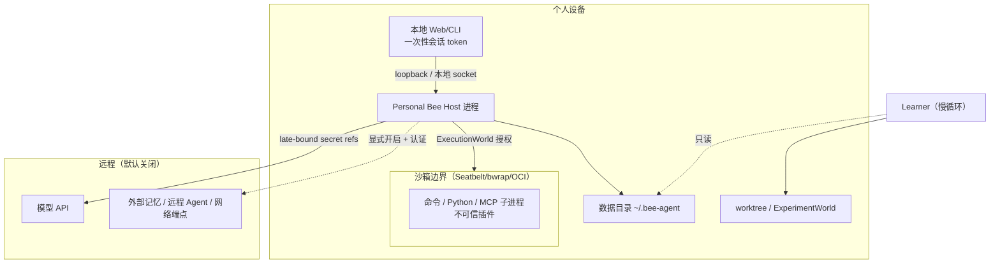

# Bee Agent v1.0.0 威胁模型与个人数据目录设计

> 状态：Proposed
> 上游文档：[bee-agent-v1.0.0-architecture-upgrade.md](./bee-agent-v1.0.0-architecture-upgrade.md) §13、§16；[重构开发计划](./bee-agent-v1.0.0-refactor-development-plan.md) 任务 P0-7
> 日期：2026-08-24
> 本文档是 v1 各阶段安全实现的共同参照：Phase 1（安全默认值先行）、Phase 3（ExecutionWorld/沙箱）、Phase 4（数据目录与导出）、Phase 6（发布验收 §20.6）从这里取验收口径。

## 1. 范围与安全目标

Bee Agent v1 是**单用户、本地优先**的个人智能体。威胁模型围绕"一个人的设备上的一个 Host 进程"展开，不考虑多租户隔离与抗 DoS 规模化（方案 §2.2 明确排除）。

安全目标按优先级：

1. **凭据不泄露**：个人 API key、token、浏览器会话等永远不进入 Chronicle、事件 payload、artifact、日志或模型可见上下文；
2. **稳定区不可自改**：审批规则、根策略、个人凭据、稳定运行结构对慢循环/Learner 只读（方案 §11.4 不可自改根信任区）；
3. **真实副作用有边界**：文件、进程、网络、子 Agent 的每次执行都经过权限交集与沙箱，取消后无孤儿资源；
4. **事实可审计**：Chronicle 不可篡改重写（append-only + expected sequence），任何投影可重建。

## 2. 资产清单

| 资产                               | 位置（目标）                              | 损失后果                                   |
| ---------------------------------- | ----------------------------------------- | ------------------------------------------ |
| Chronicle 事件流                   | 数据目录 `chronicle.db`（SQLite）         | 隐私全景泄露；事实源被污染后记忆/世界全错  |
| 个人记忆（Claim/Representation）   | 同上（memory-bee 表族）                   | 对用户的错误画像；被投毒的偏好影响后续决策 |
| 个人凭据                           | 系统 keychain 或数据目录 `secrets` 引用仓 | 直接财务/身份损失                          |
| Artifact 内容寻址库                | `artifacts/`                              | 文档、代码、产出物泄露                     |
| 审批规则与根策略                   | `config/` + Chronicle 记录的结构版本      | 边界被放宽后所有执行失控                   |
| 稳定运行结构（代码/配置版本）      | 仓库 + worktree + `config/`               | 后门进入日常执行路径                       |
| Thread/对话内容                    | Chronicle                                 | 隐私泄露（与事件流同域）                   |
| 后台学习产物（Proposal/ChangeSet） | `experiments/`（隔离区）                  | 伪改进/后门候选进入个人试用                |

## 3. 信任边界



六条边界及默认策略：

| 边界               | 默认策略                                                                 | 失败模式                                |
| ------------------ | ------------------------------------------------------------------------ | --------------------------------------- |
| 本地 UI ↔ Host     | 仅 loopback/本地 socket；一次性会话 token；CORS 仅自身 origin            | fail closed（远程默认不可达）           |
| Host ↔ 模型 API    | 出站 HTTPS；key 晚绑定注入请求头，不落盘不进事件                         | 请求失败 → 重试分类 → 显式降级          |
| Host ↔ 子进程/沙箱 | ExecutionWorld 统一管线：授权 → 空白 env 基线 + 白名单 → 资源上限 → diff | 平台无法强制时 fail closed，不裸跑      |
| Host ↔ 数据目录    | 单用户文件权限（0700 目录 / 0600 文件）；secret 只存引用                 | 损坏 → 从 Chronicle + artifact 重建投影 |
| Learner ↔ 稳定区   | 只读副本 + disposable worktree；无个人 secret（用模拟值）                | 输出 ChangeSet，需用户批准才激活        |
| Host ↔ 远程端点    | 默认关闭；显式开启必须配认证；网络按域名/IP/端口授权                     | DNS rebinding 防护；未授权域名拒绝      |

## 4. 攻击面与威胁（按边界）

### 4.1 HTTP/SSE API（Phase 1 先行收紧）

- **T1 未认证远程访问**：Host 意外暴露非 loopback 地址或插件自动开端口 → 化解：默认仅 loopback；远程模式必须显式配置认证；插件无权改变监听面（方案 §16.4）。
- **T2 CORS 反射任意来源**（v0 现状）→ 化解：CORS 仅自身 origin；SSE 劫持路径同规则。
- **T3 SSE/请求资源耗尽**：长连接与超大 payload → 化解：请求大小、并发、后台资源保守上限；空闲降速。

### 4.2 模型输出（prompt injection 与决策污染）

- **T4 间接注入**：网页/文件/MCP 工具结果中携带指令劫持模型决策 → 化解：工具结果按"数据"标记进入上下文（与用户指令分级渲染）；真实副作用仍由权限引擎裁决——模型"说"了不算，`authorize` 通过才算（方案 §13.3）。
- **T5 模型总结当事实**：推断内容写回污染 Chronicle/记忆 → 化解：推断只能成为带 provenance 的 Claim（方案 §12），事实源永远是原始观察事件。

### 4.3 执行能力（Phase 3 主战场）

- **T6 直接 spawn 绕行**：新代码再引入 `child_process.spawn` 或继承 `process.env` → 化解：eslint 全仓库禁令（白名单仅 execution 包/workers）；secret 泄露扫描进 CI（方案 §17.3）。
- **T7 路径逃逸**：symlink、`..`、worktree 外写入 → 化解：workspace allowlist + 只读/读写分离 + 规范化校验；沙箱层二次强制。
- **T8 网络外联**：数据外发到攻击者端点 → 化解：默认无网络；按域名/IP/端口授权；DNS rebinding 防护；审批展示展开后的真实目标。
- **T9 孤儿进程/子 Agent**：取消不彻底 → 化解：进程树取消 + 租约回收 + CI 用孤儿检测测试验证。
- **T10 审批疲劳**：高频低信息审批诱发一键放行 → 化解：审批必须展示展开后的路径/命令/域名/secret scope（禁止自然语言转述）；低风险授权可记住（单调收紧）。

### 4.4 插件供应链（Phase 1 manifest、Phase 3 强制）

- **T11 恶意/被劫持插件**：声明能力与实际行为不符 → 化解：manifest 强制声明 capability/permission/进程网络文件需求；来源 hash/签名；未知权限或冲突启动失败（fail loud）；非可信插件默认不启用。
- **T12 插件热换窗口**：替换瞬间的语义漂移 → 化解：A/B/C 分级 + Turn 固定 StructureVersion + drain/quiesce + quarantine（ADR 0018）。

### 4.5 慢循环与自改进（Phase 5）

- **T13 自我后门**：Learner 生成的 ChangeSet 携带越权代码 → 化解：ExperimentWorld 无真实 secret、只读轨迹副本、禁止访问审批设置与 Chronicle 改写路径；L3 必须用户批准；输出内容寻址可审查（方案 §13.6）。
- **T14 reward hacking / 自我投毒**：优化代理指标、把错误总结反复当事实 → 化解：holdout、guardrail、来源权重、时间外验证（方案 §11.5）。
- **T15 自治升级**：系统自行放宽自治级别或权限 → 化解：硬编码不可自改项；任何权限变更生成新的 StructureVersion 并入 Chronicle 审计。

### 4.6 数据目录与导出（Phase 4/6）

- **T16 本地文件窃取**：数据目录权限过宽、导出文件遗留明文 → 化解：0700/0600 权限；导出默认剔除 secret（仅引用计数）；导出文件写入前提示。
- **T17 v0 导入投毒**：恶意构造的"导出包"借导入写入危险结构 → 化解：导入是离线一次性工具，导入内容全部标记 provenance=v0-import，schema 校验失败即整体拒绝。

## 5. 个人数据目录布局

单一根目录，默认 `~/.bee-agent`，可用 `BEE_AGENT_HOME` 覆盖；安装后自动创建，权限 0700：

```
~/.bee-agent/                    # 0700
├── chronicle.db                 # 0600，SQLite：Chronicle + Kanban + 审批 + memory-bee 表族
├── chronicle.db-wal / -shm      # SQLite WAL 副产物，同权限
├── artifacts/                   # 内容寻址 artifact 库（sha256 前两层分桶）
│   └── ab/cd/abcdef…            # 0600
├── secrets/                     # 仅引用记录与作用域元数据；值优先存系统 keychain
│   └── refs.json                # 0600
├── skills/                      # 用户级 Skill 包（含 eval）
├── experiments/                 # 慢循环隔离区：ChangeSet、冻结数据集、指标（Phase 5）
├── config/                      # bundle 定义、权限策略、预算（变更入 Chronicle）
│   └── bundles/bee.json
├── exports/                     # v0 导入/用户导出的落点（一次性，用后即删）
└── logs/                        # 本地诊断日志（脱敏；不含 secret 与完整 payload）
```

约束：

- 所有子系统的默认路径都从 `BEE_AGENT_HOME` 派生，不散落在 cwd 或临时目录；
- `config/` 的每次变更生成新 StructureVersion 并写入 Chronicle（ADR 0018），配置漂移可审计；
- 多设备/远程 Worker 场景才允许把 chronicle 换成 PostgreSQL（ADR 0027，Phase 4），目录中其余部分仍在本地。

## 6. v0 export/import 边界

- **export**：对 v0.11 的 SQLite/PostgreSQL（`agent_events`、memory chunk 元数据）导出为 JSONL 事件 + artifact bundle；secret 永不导出；
- **import**：Phase 6 的一次性 CLI 工具；目标 schema 校验失败整体拒绝；导入事件的 `actor` 标记为 `system:v0-import`，`ingestTime` 取导入时刻，`eventTime` 保留原值（双时态语义天然区分）；
- 旧 MemoryRuntime 的向量数据不迁移（embedding space 依赖旧模型），只导入原文档与 chunk 文本，由 v1 memory-bee 重新索引；
- 不提供双向同步：v1 不回写 v0 存储。

## 7. 阶段落地索引

| 威胁         | 化解落地阶段（开发计划任务）                        |
| ------------ | --------------------------------------------------- |
| T1/T2/T3     | P1-14（安全默认值先行）                             |
| T4/T5        | P1-11 AgentLoop 数据分级渲染；P4 记忆 provenance    |
| T6           | Phase 3 spawn 禁令已启用；仅 execution 包可创建进程 |
| T7/T8/T9/T10 | Phase 3 WF3-B/C/D/F                                 |
| T11/T12      | P1-2/P1-4（生命周期与热换）+ Phase 3 manifest 强制  |
| T13/T14/T15  | Phase 5 WF5-C/D/E                                   |
| T16          | Phase 4（数据目录）+ Phase 6（导出）                |
| T17          | Phase 6 WF6-C（v0 导入工具）                        |
